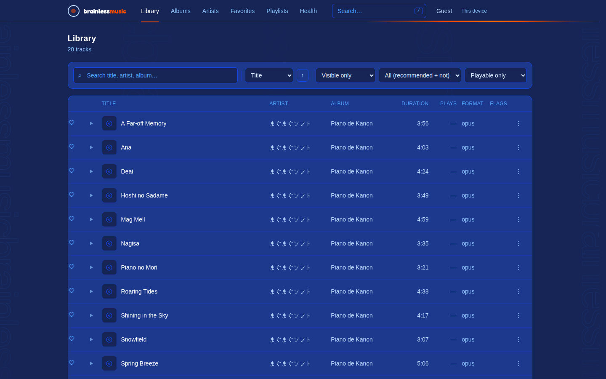

# Changelog

Backfilled 2026-09-03 (didn't exist before). Newest first. Only covers backend/frontend code changes, not doc-only commits.

---

## 2026-09-11 — A way back out, and a backdrop that goes somewhere

Two pieces of owner feedback.

**There was no way out of the app.** The header had "Log out" for an account and
"This device" for a guest, and neither is an exit — one ends the session, the
other opens a dialog about abandoning the identity. Nothing took you back to the
title screen. There is now an **Exit** button, in orange, which is the accent
the rest of the arcade furniture already uses (the tab underline, the boot
frame, the enter button), so the control that returns you to that screen wears
its colour.

Exit is deliberately **not** a log out. The token stays in the browser, so
pressing enter again comes back as the same listener with the same history —
for a guest that distinction is everything, because there is no password to
return with and dropping the token would be a deletion rather than a sign-out.
The title screen reads the difference from a `sessionStorage` flag: its redirect
exists so a signed-in tab cannot land on the attract screen by accident, which
makes arriving there deliberately the one case it gets wrong. On the way back
the button reads **Click here to resume** and the copy says the library is still
there, because an attract screen that appears after you press "Exit" otherwise
raises exactly the wrong question.

**The guest name is gone from the header.** A guest's row is called
`guest-a83f2c` — a database identifier, not a name anybody chose — and "Guest"
standing in its place named nothing the listener did not already know, while
occupying width the header can least afford. An account still shows its
username, which answers a question a shared machine can genuinely raise.

**The backdrop crosses the screen now, as well as climbing it.** Two bands of
the wordmark crawl sideways, in opposite directions, at co-prime beat counts
(149 and 181) that are also co-prime with the columns' — so nothing in the field
ever comes back into step with anything else. The columns gave the backdrop a
grain, and a grain has no direction: after a few seconds the eye stops reading
it as motion at all. A band travelling the full width is something it can
follow.

Each band renders eight copies of the lockup per run, because the seamless loop
shifts by exactly one run and a run narrower than the window shows as a gap
crossing the screen. Eight holds at any window shape without measuring
anything, since the type is sized in `vw`.

**Measured, same method as before** — the page heading, which sits on the page
background, *and* a gutter as a control, because a region clipped to an opaque
card reports zero however loud the backdrop gets:

| | before the bands | with them |
|---|---|---|
| behind the page heading | 5/255 | **5/255** |
| in the gutter | 20/255 | **38/255** |

So the field is nearly twice as present where there is nothing to read, and
costs the reading exactly nothing. That is the shape the approved-subtlety note
asks for.

**Verified:** 29/29 checks in headless Chromium — Exit present and painting
`oklch(0.646 0.222 41.116)` (asserted at the pixel, not the class name), no
"Guest" anywhere in the header, Exit landing on the title screen rather than
being bounced off it, the token byte-identical across the round trip, a reload
holding position, resuming returning `guest-6ef52b#11` rather than a new row, a
tab that never exited still opening into the app, both bands moving in opposite
directions with runs wider than the window, reduced motion holding everything
still, and Exit reachable on a phone.

**The phone header got worse, and that is worth saying plainly.** It already
overflowed — six tabs measured 933px at a 390px viewport — and Exit takes it to
**981px**. The button was asked for and it is the only way back, so it stays;
but the header's narrow-screen layout is now overdue rather than merely known.

## 2026-09-11 — Tabs change like a menu, not like a page

Phase 5 of `.docs/features/arcade-transitions/planning.md`, which completes the
feature.

**The underline travels.** It used to be an `::after` on the active tab, which
cross-faded from one tab to the next. It is now a real element rendered only
inside the active link — so exactly one of them exists at any moment, which is
what lets it carry `view-transition-name: nav-underline` and have the browser
tween its position and width between tabs for free. A pseudo-element cannot be
named, and a name that appears twice disables the transition for the whole
page, so "only the active tab renders one" is a correctness requirement rather
than a tidiness one. There is a check for it.

**The page slides in the direction you moved.** `data-nav-dir` on the root
records whether the clicked tab is left or right of the current one, set on the
click itself because that is the only moment both are known. Rightward sends the
old page out to the left and brings the new one in from the right; leftward
reverses it. A uniform transition reads as a fade; a directional one reads as a
place you moved to.

**React Router's `viewTransition` prop does nothing in this app**, and finding
that out is what the instrumented check was for. It is a data-router API, and
this app is mounted under `<BrowserRouter>` — so the prop is accepted, silently
ignored, and the page swaps instantly while the CSS sits unused. Every
observable symptom looked fine: the underline was in the right place afterwards,
the direction attribute was set, animations were running (the backdrop's).
Patching `document.startViewTransition` and counting the calls returned **0**.
Calling it directly works under either router and is four lines, with
`flushSync` so the DOM is in its new state before the callback returns.
Modified clicks — new tab, new window, a middle button — fall through to the
browser untouched.

`::view-transition-old(root)` and `(root)` are set to `animation: none`: between
two tabs the header, player bar and backdrop are identical, and cross-fading
identical pixels costs a composite and can stutter the moving backdrop.

**Verified:** 20/20 checks in headless Chromium — the transition actually
starting (counted at the API, not inferred), one underline at a time with the
right name, the underline moving 255px → 553px → 326px as tabs change, forward
and back both recorded, all six tabs settling fully visible and un-offset,
reduced motion arriving immediately with nothing left mid-animation, and a
phone adding no width of its own.

**A pre-existing fault found while checking the phone, not caused by this:** the
top bar's six tabs measure **933px at a 390px viewport**, so every page in the
app scrolls sideways on a phone. It is there on a direct page load with no
transition involved. Not fixed here — which tabs survive on a narrow screen, and
whether the answer is a scrolling bar or an overflow menu, is a design decision
rather than a patch.

## 2026-09-11 — The library was blank for a second and a half, and the logo answers back

Three things: a bug fix the owner reported, and two pieces of feedback on the
title screen. **Phase 5 (tab transitions) is not started.**

**The bug: pressing enter did not show the library.** Reproduced on the dev
server — the track list was still at `opacity: 0` a second and a half after
entering, and only appeared near three seconds. It did not reproduce in the
production build, which is why it had not been caught: **React StrictMode
remounts every component in development**, which recreates the staged elements
and restarts their CSS animations, 780ms delay and all, from the second mount.

The StrictMode behaviour is the trigger, but the fault is the design. The boot
classes hide content that has *already loaded*, so anything that disturbs the
animation — a remount, a stylesheet that arrives late, a browser quirk — leaves
the app blank with no way back. Two changes:

1. **The sequence has a deadline.** `AppShell` clears `isBooting` after 1,500ms
   regardless of what the animations did. With a deadline the worst case is a
   sequence that ends abruptly; with only CSS, the worst case is an app that
   never appears.
2. **The staircase is compressed** — the tail went from 780ms to 480ms. Every
   millisecond of that delay is a millisecond the app is blank for no reason,
   and the last stage is the one holding the track list.

Measured on the dev server after the fix: the library is fully visible **1,726ms
after the click**, and that figure includes the 820ms shut-off animation.

**Tapping the logo now answers.** A bright line runs across the wordmark and an
orange glow rises and falls, once per tap. Worth stating the trade, because it
cuts against the gesture's point: a logo that reacts is a logo that invites
being touched again. What it does not do is put anything in the DOM at rest —
no cursor change, no title, no hint for a guest who never touches it — so what
leaks is "this responds", not "there is a door here". Against that: a seven-tap
gesture with no feedback is one nobody can tell they are halfway through. The
line has to be a second copy of the type clipped to the same glyphs, because the
resting sheen already drives `background-position` on the text itself.

**The numpad fades in and out.** Its exit plays *before* the parent unmounts it,
since the unmount is what removes it from the DOM and there is nothing left to
animate after that. Panel and backdrop leave together — a dialog that vanishes
while its ground fades reads as a crash rather than a close.

**Verified** on the dev server (StrictMode — the path the bug was reported on):
tap flash and glow both running, numpad animating in, `is-closing` reversing the
same keyframes on the way out, unmounting cleanly afterwards, and no page
errors. `tsc` clean.

## 2026-09-11 — The backdrop goes full-bleed, and is measured rather than eyeballed

Phase 4 of `.docs/features/arcade-transitions/planning.md`.

**Two tiers, opposite directions.** The backdrop was two wordmark columns
confined to the gutters and hidden below `2xl`. It is now five, full-bleed, in
two tiers: a far tier (smaller, fainter, slow, climbing) and a near tier
(larger, brighter, quicker, falling). A single sheet of scrolling type reads as
a sheet of scrolling type; two passing each other at different rates reads as
depth, and costs nothing extra. Beat counts are co-prime — 128/97/113 against
67/53 — so no two columns ever line up and the field never visibly loops.

**The `2xl` breakpoint is gone, and its reason is not.** That rule existed
because decoration behind a data table is a bug, and going full-bleed had to
answer it rather than ignore it. A mask does: the middle of the screen is held
at 18% of the strength it has in the gutters, so motion is visible everywhere
and loudest where there is nothing to read.

**The mask's stops are `calc(50% ± 36rem)`, not percentages**, and that is the
part that took a measurement to get right. 36rem is half of `page-shell`'s 72rem
cap, so the dim band *is* the content column at every window width — which a
percentage cannot be, since the gutters are 5% of a 1280px window and 20% of a
1920px one. The first version used 26% and measured **12/255** behind the page
heading at 1440px, where the heading sits at 11% and was still inside the bright
end of the ramp. Tied to the column it measures **5/255**.

**The first version of the check was worthless, which is worth recording.** It
clipped to the track table and reported a difference of exactly zero — proving
nothing, because the table sits on an opaque `.card`, so it would have passed
with a screaming backdrop behind it. The rewritten check measures the page
heading, which really does sit on the page background, **and** a gutter as a
control: if the backdrop is not clearly visible there, the first reading means
nothing. Final numbers, worst pixel and mean over the region:

| Region | Worst pixel | Mean |
|---|---|---|
| Behind the page heading | 5/255 | 0.15 |
| In the gutter (the control) | 20/255 | 0.44 |

**Below `md` the inner columns drop out.** A phone has no gutters, so every
column there is behind the text; the `calc` also goes negative and clamps, so a
narrow screen is dim throughout. Both are the right answer for a screen with no
room beside the content.

**Verified:** 12/12 checks in headless Chromium against a seeded 20-track
library — backdrop spanning the viewport, both directions running, five distinct
speeds, every layer still moving after a full lap, the two tiers moving against
each other (-8.0 against +29.9 over the same 700ms), the pixel measurements
above, two columns on a phone rather than five, and reduced motion holding every
layer completely still. `tsc` and `oxlint` clean.

## 2026-09-11 — The machine switches off, and the next one boots

Phases 2 and 3 of `.docs/features/arcade-transitions/planning.md`. Presentation
only: nothing here changes what the app does, and with motion turned off the
whole thing is invisible and the app is immediately present.

**Leaving.** 820 ms, three planes at once. The white band collapses the way a
CRT loses its picture — squashed to a bright line, held there for a beat,
then gone sideways; the pause is the effect, and collapsing straight through
loses it entirely. The logo does not collapse with it: it keeps coming toward
the camera to 4.2x and past it. The mosaic panel opens from half the screen to
all of it underneath, so the last thing visible before black is the background
rather than the furniture that was standing in front of it.

**The logo has to change colour partway through**, which was not in the plan. It
is near-black because it was drawn to sit on a white band — and the band is
collapsing out from under it, so it spent the second half of the zoom as dark
type on a dark mosaic. It now lightens between 32% and 55%, while the band is
still bright enough to hide the crossover. Earlier and it would be white on
white.

**The request rides along with the animation, not behind it.** `Promise.all` on
the mint and an 820 ms timer: awaiting the mint first left the button reading
"Entering…" for a round trip before anything moved, which is a hang on exactly
the slow connection the animation exists to cover. A refusal reverses the whole
thing and puts the error back on the title screen — animating away and *then*
finding out the server said no is the one outcome this must not produce, and
there is a check that drives it with an intercepted 503.

**Arriving.** 1,150 ms of assembly, played once per entry and never on a
reload: the title screen leaves a one-shot flag in `sessionStorage` and the
shell consumes it. Wordmark, then each nav button on its own 60 ms beat, then
search, then the page content. The buttons arriving **individually** rather
than the row arriving as a block is the whole difference between a machine
naming its parts and a container fading in. An orange hairline runs the
perimeter once behind all of it and leaves.

**Three bugs found by looking, not by tests passing.** The border lap was the
worst of them and took three goes:

1. `position: fixed; inset: 0` on an `<svg>` does **not** fill the viewport —
   unlike a div it has intrinsic sizing, so it laid out square at 1265x1265 in
   a 1280x800 window with three quarters of the lap below the fold. Invisible,
   and every assertion about it passed.
2. Given explicit dimensions, `viewBox="0 0 100 100"` with
   `preserveAspectRatio="none"` scaled the *stroke* non-uniformly too — a
   2-unit line became a 25px slab down one side and 16px along the top.
3. `vector-effect: non-scaling-stroke` fixed the thickness and broke the dash:
   it moves dash measurement into screen space while the length still comes
   from user space, drawing ten stubby segments round the border instead of one
   line running it.

The answer was to stop fighting the viewBox and remove it. With no viewBox,
user units are CSS pixels, the scale is uniform, and none of the three problems
exist; the rect's geometry comes from CSS, where percentages resolve against
the element box.

**And a reduced-motion bug that mattered more than any of them.** The staggered
delays are `.boot-nav > *:nth-child(N)`, and the reduced-motion override was a
plain `.boot-nav > *` — which loses on specificity. Half the top bar stayed
invisible for up to 600 ms for exactly the people who had asked for no motion.
The JS had the same shape of fault: the stylesheet stopped the picture moving
but the route change still waited 820 ms, so reduced motion was *slower* than
the animation it was meant to skip. Measured after the fix: **58 ms against
829 ms**.

**Verified:** 29/29 checks in headless Chromium, sampling the animation
mid-flight at fixed offsets from the click — band scaleY 0.69 at 280 ms and
0.012 at 600 ms, logo 1.4x then 2.7x, panel past 1,028px of 1,280, the six nav
delays distinct and ordered, the frame covering the full viewport height, the
boot flag consumed, a reload not replaying it, every staged element ending at
full opacity and un-offset, and nothing left mid-animation under reduced
motion. `tsc` and `oxlint` clean.

**Not built yet, and next:** the full-bleed counter-scrolling parallax (Phase 4)
and per-tab transitions on the top bar (Phase 5).

## 2026-09-11 — The title screen, and a numpad nobody can see

Phase 3 of `.docs/features/guest-access-and-title-screen/planning.md`. The
login form is gone from the app's front door; what is there instead is an
arcade title screen with one thing to press.

**`/enter` is the new front door.** The wordmark runs at **70% of the viewport
width** on a desktop — this is the logo at poster scale the reference screens
use, not a header. `RequireAuth` sends you here, `/signup` is deleted, and
`SignupPage` with it.

**Three animations, and no more than three.** An entrance that *settles* rather
than looping — a title screen that never stops moving is one nobody can read —
a highlight crossing the letterforms every eight bars, and the enter button
pulsing the way `PRESS START` blinks. All three run off the existing `--beat`
clock, so they agree with the mosaic panel that was already there. The button
pulses in **colour, not opacity**: fading a button fades its label with it, and
a control that drops below readable contrast every two seconds is worse than
one that does not blink at all.

**The hidden admin entrance.** Seven taps on the wordmark, each within ~1.5s of
the last, opens a numpad. There is nothing in the DOM to find — no title
attribute, no aria-label, no pointer cursor, and the string "login" appears
nowhere on the page; a browser check asserts all of that. The code goes to
`POST /auth/unlock`, never to a comparison in React.

**One reversal from Phase 2, made deliberately.** `/auth/unlock` used to refuse
a wrong code and an unconfigured one identically, so the numpad could not be
used to detect whether a server had an admin door. That would have **locked the
owner out** of the door the UI had just hidden: with `ADMIN_ENTRY_CODE` unset —
the default — no code could ever satisfy it, and the numpad was the only route
there. It now hands out a ticket freely when no code is configured, which grants
nothing, because `/auth/login` does not ask for one in that configuration. The
cost is one bit that a single login attempt reveals anyway.

**Handoff.** Guest identities are per-device by design, which is right and which
costs box 25 its cross-device resume. `This device` in the header shows a QR and
a link (`/enter#t=…`); the other device adopts the identity and the resume
position follows. **The planned `GET /auth/handoff` was not built** — the client
already holds the token it would have returned, so the endpoint had nothing to
do. The token is stripped from the address bar on arrival, and the screen says
plainly that adopting *replaces* rather than merges.

**A guest is not shown their row id.** The header says `Guest`, not
`guest-a83f2c`, and offers no `Log out` — clearing the token abandons the row
and everything on it for good, so that lives behind a warning inside the dialog
instead of sitting in the header next to everything else.

**Two layout faults found by looking at the screenshots, not by a test
passing.** On a 390px phone the wordmark ran to within 11px of the right edge
with the decorative panel showing through behind it — it read as a rendering
fault. The band's white now runs to 88% below `md` and the type is sized from
what actually has to fit (`brainlessmusic` plus the mark measures ~6.6x the
font size), so 11.5vw is the ceiling, not a number chosen by eye. The bounding-box
check had passed on the broken version; the screenshot is what caught it.

**Verified:** 42/42 checks in real headless Chromium at 1280x800, 390x844 and
844x390 (landscape), each "device" in its own browser context so localStorage
could not leak between them. Covered: logo scale, tap-target size, the HUD
reading `VER 0.1.0 / SERVER OK`, guest entry end-to-end, two browsers getting
two identities, handoff adopted and the hash stripped, six taps doing nothing
and the seventh opening the numpad, a wrong code refused by the server, the
right one reaching `/login`, the ticket in `sessionStorage` and not
`localStorage`, the code never echoed, `/signup` gone, no sideways scroll, and
reduced motion leaving the logo at full opacity and un-offset. 281 backend tests
pass. `tsc` and `oxlint` clean.

**Operational note, pre-existing and not introduced here:** `@fastify/static`
resolves the built assets at registration, so rebuilding the frontend while the
API is running serves 404s for the new hashed filenames until the server is
restarted. Irrelevant in the container, where `dist` is baked into the image.

## 2026-09-11 — A door with no password, and a numpad in front of the one that has one

Phase 2 of `.docs/features/guest-access-and-title-screen/planning.md`. Backend
only: nothing on screen changes yet, and `/login` still works the way it did
this morning.

**Guest entry.** `POST /auth/guest` mints a passwordless `users` row
(`kind = 'guest'`) and signs **the same session token `/auth/login` signs**.
That sameness is the whole reason this was half a day rather than a week: every
user-scoped route reads `request.user.id` and nothing else, so favorites,
playlists, history, scrobbles, `playback_state` and the media-token exchange
all work for a guest without one line changing in any of them.

Migration `0012` adds `kind` and `last_seen_at`. A sentinel `password_hash` was
considered and rejected — `''` is a value `bcrypt.compare` will happily be asked
about, which leaves "this row cannot log in" living in whoever remembers to
check it. `/auth/login` now refuses on `kind` *before* it reaches a hash.

**One identity per device** ([A13](QUESTIONS.md)), so nobody shares a queue or a
resume position with anybody. The cost is honest and recorded: the phone is a
different listener from the desktop until the handoff link ships in Phase 3, and
until then box 25's cross-device resume does not hold.

**The numpad is not decoration.** The title screen will hide `/login` behind a
tap gesture, but hiding a route in a single-page app hides nothing — the bundle
carries the route table, and the endpoint answers `curl` regardless. So the code
is checked by the server: `POST /auth/unlock` mints a `scope: 'unlock'` ticket,
and while `ADMIN_ENTRY_CODE` is set `POST /auth/login` **refuses without it**.
Verified over real HTTP, which is the check that says this is real: the correct
username and the correct password with no ticket returns
`401 invalid username or password` — the same words a wrong password gets, so
the endpoint never confirms that a code exists. The ticket carries no `sub`,
identifies nobody, and the existing scope rules refused it as a bearer
credential and as a media token without needing to be told it exists.

**Limits, because unauthenticated row creation is new.** A per-IP window on both
new endpoints (10 mints/hour, 5 numpad answers/minute, `Retry-After` on the
refusal), and a ceiling of 50 guests. At the ceiling the server prunes guests
idle for 90 days — with their favorites, playlists, history and resume position,
since nothing can ever log back in to claim them — and only refuses if that
frees nothing. Pruning runs *only* under cap pressure, never on a timer, and can
never touch an account at any age.

**`ALLOW_OPEN_REGISTRATION` now defaults to `false`** ([A16](QUESTIONS.md)) —
`/signup` loses its reason to exist in Phase 3. The bootstrap window that lets a
fresh server be claimed now counts **accounts, not rows**: the first visitor to a
new server presses "enter" and mints a guest, and counting that would have
slammed the window shut on a server with no admin, with no way back but the CLI.
There is a test for exactly that.

**Verified:** 280 backend tests pass (23 new), `tsc --noEmit` clean, and the
whole flow exercised over HTTP against a scratch database on :3099 — entry code
refused/accepted, guest token reaching `/api/tracks` and `/auth/media-token`,
guest refused by `/users` and `/library/scan` (403), bootstrap register still
open with a guest present, login refused without a ticket and accepted with one,
ticket refused as a credential, and the rate limit returning `429` with
`retry-after: 3580` on the eleventh mint. Migration applied to the live database
behind `data/brainlessmusic.pre-0012-backup-2026-09-11T00-42-55.db`;
`imran` (id 13) came through as `kind = 'account'`, `integrity_check` ok.

**Not done here, and not hidden:** `backend/.env.example` is not writable from
this environment, so the five new variables (`ENTRY_CODE`, `ADMIN_ENTRY_CODE`,
`UNLOCK_TICKET_TTL`, `MAX_GUESTS`, `GUEST_IDLE_DAYS`, plus the two rate knobs)
are documented in `README.md` but have to be copied into that file by hand.

## 2026-09-10 — The 64k target starts telling the truth, and the toggle stops going quiet

Answering [A12](QUESTIONS.md) turned into three fixes, only the first of which
was the question.

**libopus was ignoring the number it was given.** `-b:a 64k` is a VBR *target*
to it, and it ran 16% over. `-vbr constrained` holds it: measured through
`encodeToFile`, the app's own path, **1,597,894 bytes / 74.3 kbps → 1,395,366 /
64.9 kbps** on the same source. The readout now says `OPUS · 65k`. The variant
id went `opus64` → `opus64c` in the same change because the id *is* the cache
key — leaving it would have kept serving old encodes with nothing to tell them
apart. Old files are never requested again and age out through LRU.

**Which made every entry cold, and revealed that the toggle went silent.**
Measured 5.71 s of nothing for a 172-second track, because the swap replaced
`audio.src` and *then* waited for the encode — while the copy already playing
was perfectly good the whole time. Now the converted copy is warmed first and
the element is only touched once the file exists. The audio element no longer
emits a `pause` at all across the swap. Not a regression from the encoder
change; a pre-existing hole that always-warm testing had hidden.

**And the scrubber flicked back to zero.** Reassigning `src` resets the
element's clock, and the `timeupdate` handler faithfully painted that. Suppressed
for the duration of the swap: largest backwards jump measured 0.000 s, down from
-8.9 s.

Two more caught by the tests rather than by reading, both mine:

- **A cached probe looked like a failure.** The readout asks for one byte and
  read the total out of `Content-Range`, which only a 206 carries — but Chrome
  can answer a repeat request from its own cache with a 200. The probe returned
  null, the swap treated that as "could not prepare", and it *reverted the
  listener's preference*. It now reads `Content-Length` when there is no range.
  The same bug would have made the bitrate readout silently disappear.
- **An aborted request is not a refusal.** Reverting the toggle on any failure
  meant a page navigating away mid-request quietly undid a choice that had been
  made. Aborts now return without touching the preference.

28 browser checks across six suites and 257 backend tests.

---

## 2026-09-10 — Close the tab, open the phone, carry on

Roadmap box 25. A `playback_state` table, one row per user — `user_id` is the
primary key, so "last write wins" is a property of the schema rather than
something application code has to keep remembering. Per-device state was
considered and rejected: the desktop would never learn where the phone got to,
which is the entire point of the box.

**The current track is deliberately not a column.** It is `queue[queue_index]`,
and storing it as well would create two places to be right about one fact.

**Loading is where the work is.** A queue is saved as ids and read back days
later, by which time tracks in it may have been deleted or gone missing from
disk. Both are dropped on read, which means the saved index cannot be reused —
it is re-derived from the surviving rows. If the track being played is itself
gone, the resume moves *forward* to the next survivor rather than back to the
start of the queue, and its position does not carry over to a track nobody was
playing. Restoring someone into a track that cannot play is worse than not
restoring them, because it looks like the feature worked.

**The client writes at three moments**, because none covers the others: a tick
every 10 s while playing, so a crash loses at most one interval; the moment
playback pauses or moves to another track; and `visibilitychange`, not
`beforeunload` — the latter does not fire reliably on a phone, which is exactly
where a backgrounded tab gets killed.

**It restores paused, on purpose.** Browsers block autoplay without a user
gesture, so "resume and play" would silently do nothing on a phone. The state
comes back, the play button does the rest. Native Android has no such
restriction and can decide differently — that is why Q9 asks.

**Closing the player forgets; logging out does not.** These used to be one
call. Sharing it would mean a token quietly expiring threw away the very
position the feature exists to keep, so `stop` (session teardown) and
`stopAndForget` (the ✕, a deliberate "I am done") are now separate.

Two bugs found by the browser tests rather than by reading:

- **Restore never fired.** StrictMode invokes effects twice; the first run's
  cleanup cancelled the only fetch that ran, because the second bailed on the
  already-set ref. The guard that actually matters is whether audio is loaded
  by the time the fetch resolves — if it is, the listener got there first.
- **The desktop ✕ bypassed the split.** It called the local `stop` directly
  rather than the context's, so closing the player on desktop left the saved
  position behind. Only the phone sheet, which goes through the context, was
  doing the right thing.

19 new backend tests (257 total, up from 238) and 11 browser checks across two
tabs: a new tab restores the right track at the saved position, paused; pressing
play continues from there; ✕ clears the server state; logging out keeps it.

---

## 2026-09-10 — Data saver becomes something you can actually press

The backend half of roadmap box 24 had been finished and verified for a day, and
nobody could reach any of it: `buildStreamUrl` had accepted a `quality` argument
since `f3bd28d` and no caller ever passed one, so `?quality=low` existed only for
whoever was willing to hand-edit a URL. This is the half that surfaces it.

**The toggle applies to the track that is playing.** Not to the next one — a
control that appears to do nothing for the remaining four minutes reads as
broken, and the listener who just turned it on is the one person actively
watching for an effect. Swapping mid-track is only possible because of the cache
that landed in `216aaf7`: the small copy is a complete file with a length, so it
can be seeked straight back to where the listener already was. Position,
play/pause state and the in-progress scrobble all survive the swap. The scrobble
is the one worth naming — it is the same listen, so the progress record is left
alone and `lastTime` is re-anchored to the resume point, which stops the jump
back up from 0 being counted as time heard.

**The readout reports what was served, not what was asked for.** These come
apart on exactly the files the feature exists to protect: `variantFor` refuses to
downgrade a source already at or below the target, so a 42 kbps Opus file is sent
untouched no matter what the URL says. Printing the request as though it were the
result would be a readout that lies precisely where it matters. An `<audio>`
element exposes no response headers at all, so the truth costs one extra
`Range: bytes=0-0` request — nearly free on a cold cache, since the element is
fetching the same variant at that moment and the backend's in-flight map
collapses the two into one transcode. The bitrate is measured from the bytes on
the wire rather than read off a tag, which keeps it honest for remuxed and
re-encoded copies whose source numbers no longer describe them.

Both player surfaces get it: a pill in the phone sheet beside shuffle and repeat,
a button on the desktop bar beside them. The phone's served badge appears **only
when it disagrees with the specs badge above it** — data saver re-encoding, or a
container swap like raw ADTS served as m4a. Serving a file as-is would otherwise
print `44.1 kHz · 115 kbps · Opus` directly above `OPUS · 115k`, which is noise
dressed as information.

**Measured on the real library** (19 Opus tracks, ~120 kbps): a 115 kbps source
serves at 74 kbps with data saver on, a 36% saving. That is the honest number for
*this* library, and it is the same 36% that argued against building the feature
at all before FLAC was in the picture — where the same path measured 93%.

Verified in headless Chromium at both widths, 12 checks: plays at full quality
first, the toggle switches variants, position survives the swap, playback
continues, the readout changes, toggling back restores full quality, the
preference persists across a reload, and on a 390px viewport five pills fit with
no horizontal overflow. 238 backend tests pass; both projects typecheck and build
clean.

**Found while measuring, not fixed here:** the 64k Opus target lands at 74.3
kbps. `-b:a 64k` with libopus's default VBR overshoots by 16%; `-vbr constrained`
hits 64.9 kbps on the same source, a further 13% off the wire. Filed as Q13,
because changing the recipe changes the audio and the cache key does not include
it — existing entries would keep serving the old encode.

---

## 2026-09-10 — The real waveform stops looking worse than the fake one

Checking whether the Now Playing waveform was still decorative turned up that it
is not — `GET /tracks/:id/waveform` has decoded real peaks since `0009`, and the
hash-based bars are only a fallback. Two things fell out of looking.

**The feature had never once run.** `waveform` was populated on 0 of 19 tracks,
and on 0 of 30 before the missing-track cleanup, so no track has ever been
analysed. `NowPlaying` mounts only when the phone sheet is open and is
`md:hidden`, so no desktop session has ever fired the query. Nothing is broken;
the trigger has simply never been pulled. It will populate on first open on a
phone.

**And when it does, it would have looked flat.** Peaks are absolute amplitude,
0-255, drawn against 255 as full height. Decoding a real library track outside
the app the same way `computePeaks` does, the loudest bucket measured **80** —
this is quietly-mastered piano — so the waveform would have sat in the bottom
third of the scrubber, *flatter than the random placeholder it replaces*. The
honest scale looked like the broken one.

`barsFromPeaks` now scales each track to its own loudest bar, but only up to a
ceiling that rises with how loud the track actually is: full-scale may fill the
height, near-silent may not climb past `QUIET_TRACK_CEILING` (0.55). The
measured track goes from 31% to 69% of the height; a track a quarter that loud
reaches 58%, so it still reads as the quieter one. An all-silent track divides
by nothing and stays the flat 0.06 line rather than `NaN`. Stored peaks are
untouched and stay absolute — this is a presentation choice, so it lives at the
point of drawing, and needs no migration or re-decode.

Chosen by the owner over leaving it absolute (mostly a thin strip) and over
normalising fully (a whisper and a wall of noise draw identically). Verified by
running the new scaling over the real measured peaks: 0.06-0.691 on the real
track, 1.0 flat on a full-scale signal, 0.06 flat on silence, and the track's
fade to nothing at the end preserved (0.25 → 0.22 → 0.17 → 0.06). `tsc --noEmit`
clean.

---

## 2026-09-10 — Converted copies are kept, so the data-saver path became ordinary

The cache half of roadmap box 24. `?quality=low` used to be a live encode: no length, no byte ranges, no scrubber, and a second lossy generation every single play. It now writes the conversion to disk and serves *that*, which changes what kind of thing it is. A finished file has a length, so it gets `Content-Length`, `Accept-Ranges: bytes`, an `ETag`, a `304` on revalidation and working seeks — every one of them for free, because the route already knew how to serve a file and now simply points at a different one.

**Convert first, then serve** — decided against streaming-while-encoding on a measurement rather than a preference. At ~96x realtime the wait is small enough that the whole class of problem disappears: no output tee, no partial file that looks complete, one ffmpeg run. Measured end to end on a 25-second FLAC: **0.88 s cold, 0.027 s warm** — a 33x difference — and 3.32 MB down to 0.24 MB, a **93% saving**. That is the number that justifies the feature; the 36% measured against an Opus source is what argued against building it at all.

**Four things that fail quietly, and what was done about each:**

- **A key that misses a changed source.** Entries are named from source size + mtime + variant — the same pair the `ETag` already trusts to mean "different file". A replaced source simply misses and the stale entry ages out. There is no invalidation step to forget to call.
- **A partial file that looks complete.** Encode to a temporary name, `rename` on success. A rename within a directory is atomic, so a reader finds either a whole file or none. This matters more here than usual, because transcodes are SIGKILLed on client disconnect by design.
- **Two requests racing to write one path.** An in-flight map keyed by entry name, the same shape `waveform.ts` uses for the same reason. Tested with two concurrent cold requests: one file results.
- **Eviction deleting someone else's files.** Only names matching this module's own pattern are ever considered, the rule `pruneBackups` already follows. Tested with a bystander file that survives an eviction that clears everything else.

Eviction is least-recently-used, runs after a write — the only moment the cache can grow — and reads mtime, which is touched on every cache *hit* so it means "last used" rather than "created". Deleting an entry another request is streaming is safe: the reader holds it open and the bytes outlive the name.

**Converting is skipped when it cannot pay.** Below `TRANSCODE_MIN_SOURCE_BITRATE_RATIO` (1.5) x the 64k target, the original is served. Verified live: a 42 kbps Opus file served as `audio/opus` on both paths and wrote nothing to the cache.

### Raw `.aac` is remuxed, always

Not a quality decision — a correctness one, and it rides the same machinery. A raw ADTS file has no container and no reliable duration: measured, a 25.0 s file reports **37.9 s** to both ffprobe and Chrome. Remuxing copies the AAC frames untouched (`-c:a copy`, so no quality cost) into an MP4 that states the real length. Verified: the same track that read 37.9 s on disk now serves at **25.0 s**, matching the frame-scanned value in the database.

### Removed: the live-transcode path

`?t=`, `parseStreamOffset` and `transcodeToLowQuality` shipped earlier the same day so the data-saver path could be seeked at all. Serving a finished file supersedes them — seeking is now a byte range — so they were deleted rather than left as unreachable branches. 116 lines. The history keeps them if the first-play wait ever needs a live fallback for very long tracks.

**Verified** in real headless Chromium against an isolated library: a FLAC and a WAV at `?quality=low`, and the remuxed AAC, each reported a 25.0 s duration, **seeked to 15 s exactly**, and kept playing past it. That is roadmap box 24's done-when. 238 backend tests pass (11 new for the cache, 5 removed with the live path).

---

## 2026-09-10 — The upload ceiling fits the formats now

`MAX_UPLOAD_SIZE_MB` defaulted to 100, which is under a *single* hi-res FLAC — the owner confirms they run to hundreds of megabytes. Adding `.wav` and `.aac` without moving this would have meant a library that accepts seven formats and an upload route that rejects two of them. Raised to **1024**.

The number is a guard against a slip — a whole album dragged in as one file, a wrong folder — not against an attacker: `POST /tracks/upload` is admin-only, which is what makes a ceiling this high reasonable. Two consequences are written down beside it, because neither is visible from the constant: the web client uploads **3 at a time**, so the real worst case is roughly 3 GB in staging at once and `UPLOAD_STAGING_PATH` needs the room; and a reverse proxy in front of this (roadmap box 13) will have its own body limit that must be raised to match, or it rejects first and the app never sees the request.

**The rejection path had no test at all**, which was fine while the number was one nobody touched and not fine now that it is tunable. Three added, against an app built with a 1 MB ceiling so they run in milliseconds rather than moving a gigabyte: an oversized file gets a clean `413` rather than a `500`, **nothing is left behind in staging** when it refuses — a rejected gigabyte that kept its partial file would fill the disk one failure at a time — and an unsupported extension is still rejected before size is ever considered. All three pass, so `@fastify/multipart`'s `truncated` flag does behave the way the route already assumed.

232 backend tests pass.

---

## 2026-09-10 — Seven formats, verified with real decoders

The library accepted five extensions. It now accepts seven: `.wav` and `.aac` join `.flac`, `.opus`, `.mp3`, `.m4a` and `.ogg` — the set the two of us actually use. This is the ingest half of roadmap box 24; the transcode cache is separate work.

The change itself is two lines — one set, one MIME map. The value is in checking rather than assuming, because the per-format differences are exactly the kind that fail silently:

- **Every one of the seven reports a usable duration**, raw ADTS and WAV included. That mattered more than it sounds: waveform buckets are sized from that number, so a format that parses but reports `null` would draw an empty scrubber. Confirmed by decoding real ffmpeg fixtures, not by reading documentation.
- **WAV carries tags fine.** It is real-world WAVs that tend to have none, not the format.
- **Raw `.aac` carries no tags and no cover at all**, so it leans entirely on the filename fallback — which is what that fallback is for.

`mimeTypeFor` grew a test that walks `AUDIO_EXTENSIONS` and fails if any accepted extension has no MIME type. The two sets drift apart silently otherwise, and the symptom — a format the scanner ingests but the stream route serves as a download — is not one you would guess from the diff.

### The raw-ADTS finding, which decides how `.aac` gets served

A 25-second ADTS fixture reports its length three different ways. `music-metadata` scans frames and gets **25.0 s**, which is what lands in the database and what the waveform is bucketed from. **ffprobe and Chrome both estimate 37.9 s**, because raw ADTS has no container to ask and they extrapolate from bitrate and file size.

So serving `.aac` raw is worse than "cannot scrub": the seek bar is scaled 50% too long and lies, and a browser that believes the track is 37.9 s can request a `?t=` offset the server correctly rejects as past the end — a `400` that looks like a server bug. Remuxing to `.m4a` writes a real container with a real duration and all three numbers agree. That is now recorded as a decision with its evidence in the planning doc.

**Verified** end to end against an isolated library — never the real one — holding a FLAC, a WAV and a raw AAC cut from actual music: all three scanned with correct formats and durations, and all three **played in real headless Chromium**, decoding with `currentTime` advancing past 2.6 s and no decode error. The player builds its element with `new Audio()`, so it never enters the DOM; the check wraps the constructor before the app loads rather than querying for an element that was never there. 229 backend tests pass (24 new).

---

## 2026-09-10 — The data-saver path can be seeked

`?quality=low` answered `Accept-Ranges: none` and had no length, so there was no way back into the middle of a track on that path: the scrubber was dead and any reconnect restarted the song. A live encode genuinely cannot serve byte ranges — but it can be told where to *begin*.

`?t=<seconds>` now starts the transcode at an offset, passed to ffmpeg as an **input** seek (before `-i`), so it jumps to the nearest packet instead of decoding and discarding everything before it. On a long track that is the difference between instant and minutes.

A bad offset is a `400`, not a clamp. Silently starting somewhere the caller did not ask for is how a scrubber ends up lying about where playback is. Negative, non-numeric and past-the-end all reject; an offset is allowed past a *null* duration, since the scanner leaves that empty on files it could not measure and ffmpeg will simply produce nothing.

**Verified** against the live library: `t=0` returned 172.089s of audio, `t=60` returned 112.089s — exactly sixty seconds shorter — and the first eight seconds of the `t=60` stream were **byte-identical** to a locally-seeked reference encoded with the same settings (correlation 1.0000 over 128,000 samples), so it starts where it claims rather than merely being shorter. `t=-5`, `t=abc` and `t=9999` each returned `400`. 205 backend tests pass (5 new).

**Not yet reachable from the UI.** There is no data-saver toggle in the web player at all, and using `?t=` needs the client to add the offset to `audio.currentTime`, since a live encode reports its own zero. Both are Phase 3 of `.docs/features/formats-and-transcoding/planning.md`. This landed standalone because the seek gap was a broken feature independent of the cache design.

---

## 2026-09-10 — Missing tracks leave the browse listings

Flagging a dead row stopped it being invisible; it did not stop it being *offered*. A track whose file is gone still sat in the library table, the album, the artist page and search results, and clicking it was a `500`. Now it doesn't.

Excluded from: `GET /tracks` (and its count), album detail's track list, `GET /search` on both the FTS and the short-query LIKE path, and `GET /stats/top-tracks`. `GET /tracks?missing=only` returns just them and `?missing=all` returns everything — the same `all` / `only` / `exclude` vocabulary the `hidden` and `notRecommended` filters already use, so an admin reaches them in the ordinary UI rather than a separate screen. `missing_since` stores a date rather than a flag, so it needed its own clause builder: "present" is `IS NULL`, not `= 0`.

**Artists and albums disappear once nothing under them can be played.** An album whose every track is gone is worse than a dead row — it is a card in the grid that opens onto an empty page. Counts and lists were changed together, since a total the list can never reach is the pagination bug the track filter already carries a comment about. A detail page reached by direct link still resolves, with an empty album list: tidying a grid is one decision, and 404-ing a URL someone already holds is a different and worse one.

**What is deliberately not filtered**, and why:

- **Playlists.** Two reasons, and the second is decisive: a playlist quietly losing a song is a worse surprise than a song that won't play, and `PATCH /playlists/:id/tracks/reorder` validates that the client sent back *exactly* the playlist's current set. Hiding a row there would have broken drag-to-reorder for any playlist containing one. There is now a test that says so.
- **Favorites**, on the same "someone chose this by hand" reasoning.
- **Play history.** It records what happened. Hiding a play that genuinely occurred would be falsifying the log, not tidying it.

### The filter, in the UI

A fourth dropdown joins the library page's filter row — **Playable only** / **All (incl. missing)** / **Missing only** — using the same three-way vocabulary and the same control styling as the `hidden` and `notRecommended` filters beside it, so it reads as one row rather than a bolt-on.

A dropdown you can't interpret is worse than none, so three things came with it:

- **`missing` now rides on the track summary** (and `missingSince` on the detail), because a filtered list you can't tell apart is just a shorter list.
- **A red `missing` badge** on the row, next to `hidden` and `not recommended`. New `.badge-danger` class: those two are choices someone made and get neutral/caution, while this is a fault.
- **The play button is disabled on a missing row**, and playing a good row now builds its queue from playable tracks only — otherwise "All" would hand the player a queue that stalls on a `500` partway through.

The track drawer's Diagnostics tab gained a **File on disk** row, showing `Missing since <date>` in red or `Present`.

**Verified** against the live library, where 11 of 30 rows are genuinely dead: `GET /tracks` returns 19, `?missing=only` returns 11, `?missing=all` returns 30; the artists list is down to まぐまぐソフト alone and the albums list to `Piano de Kanon` alone, both reporting 19 tracks; searching `CLANNAD`, which matches all 11 dead tracks, now returns zero artists, zero albums and zero tracks. The UI was driven in real headless Chromium against that library: the filter defaults to `exclude` and shows 19 rows with no badges, `Missing only` shows 11 rows with 11 red badges and all 11 play buttons disabled and none enabled, `All` shows 30 rows with 11 badges, and no page errors in any state. 200 backend tests pass (12 new).

### Also: `LIBRARY_PATH` fixed

`backend/.env` pointed at `/mnt/wsl/music`, the tmpfs root that was lost; the real library is the 19 files at `/home/abcde/music`. Corrected (previous file kept as `.env.bak-2026-09-10`), and on the next boot the sweep flagged all 11 dead rows cleanly — 37% missing, under the 50% guard, with the 19 good tracks untouched. Nothing in `playlist_tracks`, `favorites` or `play_history` references any of the 11, so deleting those rows would cost nothing; that call is still the owner's.

---

## 2026-09-10 — The database and the disk, kept in agreement

A track row pointing at a file that is not there is invisible until someone presses play and gets a `500`. Eleven of the thirty rows in the real database were in that state, all pointing at `/mnt/wsl/music` — the tmpfs library root that was lost. Nothing was watching for it.

### A scheduled sync, split in two

Migration `0010` adds `tracks.missing_since`. The server now reconciles the database against the filesystem on a timer, and the two halves run on deliberately different schedules:

- **Reconciliation stats the paths already in the database** — one syscall per track, 46 ms for thirty of them. It runs at boot and before every scheduled scan, because it is the half that catches rot.
- **A full scan walks the library and re-reads every tag.** That is the expensive half and the only one that finds *new* music, so it runs on `LIBRARY_SCAN_INTERVAL_HOURS` (default 12) and never at startup: `tsx watch` restarts on every file save in development, and a full library walk per keystroke helps nobody.

Both go through one guarded entry point, so a scheduled run landing on top of an admin's manual one is turned away rather than queued — `POST /api/library/scan` answers `409` while a sync is in flight. Its response keeps the old `ScanSummary` shape at the top level, with reconciliation alongside under `reconcile`, so existing callers are unaffected.

### It flags, it never deletes

`missing_since` records when a file was first seen absent and is *not* re-stamped by later sweeps — it answers "since when", and re-stamping would make a months-old absence look like this morning's. It clears the moment the file returns, along with `last_stream_error`, so a library on a mount that comes and goes heals instead of accumulating damage.

Deleting would have been easier and is wrong here. Those eleven rows carry favorites and playlist entries, for files that may still be in a backup or on another disk. Removal stays a per-track decision through the `DELETE /api/tracks/:id` that already exists. `GET /api/library/missing` (admin) is the worklist; `GET /api/admin/health` carries the count, alongside `librarySyncRunning`.

### The guard is the feature

A library root that has not mounted yet is indistinguishable from one that was deleted, and this project has already destroyed its music once by acting on that ambiguity. So the sweep refuses, and says why, when either the root is unreadable, or more than `LIBRARY_MISSING_ABORT_RATIO` (default 0.5) of the library newly vanishes at once. Only *newly* missing rows count toward the ratio — otherwise a library that legitimately lost half its files once could never record the next single deletion.

The ratio needed an absolute floor too, which the tests found rather than the design: at least three tracks must be involved before it applies. A pure ratio protects small libraries into uselessness — one deleted file out of two is 50% — and the cost of being wrong below the floor is small, because the flag is reversible and self-healing.

**This found a real bug on its first boot.** `backend/.env` still has `LIBRARY_PATH=/mnt/wsl/music`, a path that does not exist; the actual library is the 19 files at `/home/abcde/music`. The guard tripped on the unreadable root and marked nothing, which is exactly right — but it also means uploads and manual scans are currently pointed at a dead directory. Not changed here, since whether that tmpfs is meant to be re-mounted is the owner's call.

**Verified** against an isolated copy of the live database, never the live one: pointed at the real library root, the sweep flagged exactly the 11 dead rows, all correctly counted as stranded outside the root, leaving the 19 good tracks alone. Booted against that copy, the startup pass logged the count and the warning, `GET /api/admin/health` reported `missingTracks: 11`, `GET /api/library/missing` returned all 11 oldest-absence-first and `403`'d a non-admin, a full scan found 19 files and updated 19, and a second scan fired 150 ms into the first got `409`. 188 backend tests pass (12 new, covering flag/clear/no-re-stamp/stranded plus all four guard behaviours). Recovery is covered by tests rather than live: demonstrating it would have meant renaming files in the owner's music library, which is not a thing to do to a library that has already been lost once.

### Also: a stale claim corrected

`.docs/STATUS.md` said there is no column for bitrate or sample rate in `tracks`. There is — `tracks.bitrate` and `tracks.sample_rate` have existed since migration `0006`, are populated by both the scanner and the upload path, and are already returned on the track detail endpoint. Only the `library-player.html` harness never read them. It matters for the transcoding work: those two columns answer "is this source already at or below the target bitrate?", and re-encoding a 64k file to 64k is pure loss.

---

## 2026-09-10 — The streaming path: leaked transcodes, and a cache that was never there

Four defects on the audio path, found by reading it end to end rather than by anything failing. Nothing here changes what a track sounds like; it changes what serving one costs.

### An abandoned transcode never died

`transcodeToLowQuality` returned a bare stream and dropped the ffmpeg handle on the floor, so nothing could stop it. ffmpeg writes to a pipe: once the listener skips the track and the response closes, the pipe fills, ffmpeg blocks in `write`, and the process sits there holding a decoder open until the server restarts. Skipping through a few tracks on the data-saver path was enough to strand one process per skip.

It now returns a `TranscodeSession` — the stream plus a `stop()` that SIGKILLs ffmpeg and releases its slot — and the route calls `stop()` on response close.

- **A second, narrower leak turned up while verifying the first.** ffmpeg spawns asynchronously, so a `stop()` arriving before the process exists has nothing to signal, and ffmpeg goes on to spawn anyway — orphaned, and past the point where we hold any handle to it. Skipping straight through tracks is precisely how a client hits that window. The kill is now re-issued on `start` if a stop already landed. Measured against real ffmpeg both ways: without the re-issue, an immediate stop leaks the process; with it, zero survive.

### Nothing capped concurrent transcodes

Every `?quality=low` request span a full-rate decode on the same machine that serves the app, with no ceiling. `MAX_CONCURRENT_TRANSCODES` (default 2) now bounds it, and past the cap the request is refused with `503` + `Retry-After` rather than downgraded to the original file — whoever asked for the small copy asked for a reason, and quietly sending ten times the bytes is the worse answer for the one person on mobile data. The full-quality path is untouched by the cap. `activeTranscodes` joins the health snapshot and the diagnostics page, so the ceiling is visible rather than inferred.

### Health reported "degraded" forever

`status` was `degraded` if the error ring held anything at all, and the ring is only ever trimmed by length — so one missing file at boot pinned the server to degraded for the rest of its life, which conveys exactly as much as reporting nothing. The verdict now expires after fifteen minutes. The errors themselves stay listed: "what went wrong earlier" is the question that page exists to answer.

### Every replay of a track was a full re-download

The stream endpoint sent no `ETag`, no `Last-Modified`, no `Cache-Control` — so a browser had nothing to revalidate against and refetched the whole file every time. Audio is the largest thing this server sends and the least likely to change: a track row keeps its path for life, and editing tags rewrites the database, not the file.

- **A strong ETag** from size + mtime, the pair nginx uses. Strong deliberately: a weak tag may not validate an `If-Range`, so a weak one would have silently disabled resumable seeking — the thing this endpoint exists for.
- **`If-None-Match` and `If-Modified-Since` answer `304`**, with RFC 9110 precedence (a tag decides alone; the date is consulted only in its absence) and second-granularity date comparison, since HTTP dates carry no sub-second part.
- **`If-Range` is honoured.** A player reconnecting mid-track sends the offset it stopped at and the validator it holds; if the file changed underneath, splicing new bytes onto old ones hands the decoder a corrupt stream that arrives looking like a successful `206`. A mismatch now resends the whole file.
- **Cached a day, not a week.** Long enough to cover an evening of listening and every seek back inside a track; short enough that replacing a file on disk cannot keep serving the old rip. Matches the waveform endpoint. The practical ceiling is the media token anyway — it rides in the URL and rotates every two hours, and a new URL is a cold cache.
- The transcoded path sends `no-store`: its length is unknown until the encode finishes, so there is nothing stable to validate against.

Also: `304` and `416` no longer count as active streams — both previously incremented the gauge on their way to sending no audio.

**Verified** against real ffmpeg and, over real HTTP, against the live library (track 110, 2,481,022 bytes): validators present on a full request; `If-None-Match` and `If-Modified-Since` each answered `304` with a zero-byte body; a stale validator resent all 2.4 MB; `Range: bytes=100-199` returned `206` with `content-range: bytes 100-199/2481022` and bytes identical to the source slice; `If-Range` matching gave `206`, stale gave a full `200`; an unsatisfiable range gave `416` with `bytes */2481022`. Data-saver: served real `OggS` output, then killing the client mid-stream left zero ffmpeg processes three seconds later; two concurrent transcodes held both slots and a third got `503` + `Retry-After: 5` while the full-quality path still served `200`; freeing a slot restored transcoding. 176 backend tests pass (41 new). No user rows were created — media auth is JWT-only, so the tokens were signed in-process.

**Noticed, not fixed:** several track rows still point at `/mnt/wsl/music`, the tmpfs library that was lost; `GET /tracks/136/stream` is a `500` for that reason. Pre-existing data drift, unrelated to this change — those rows need a rescan or a delete.

---

## 2026-09-09 — A title screen, a mobile player, and real waveforms

### The login screen, and the app frame behind it

The two looked like different products. They now share a lockup, an accent line, and — the part that actually does the work — a clock.

- **One tempo.** `--beat` sits on `:root` at 150 BPM and every animation on the screen derives from it: mosaic scroll, tile flashes, wordmark columns, banner sweeps. Independent loop lengths (a 16s scroll against a 3s pulse) drift forever and never line up, which is what made the screen read as *animated* rather than *timed*.
- **The mosaic ignites on the beat.** A wavefront crosses the grid once per beat and burns orange on the downbeat, driven by a per-tile negative `animation-delay` — no JavaScript, one keyframe stating a whole bar.
- **The halftone soundwave gave way to two oversized wordmark columns** on co-prime laps (34 and 53 beats, one offset by eleven), so the pair only realigns after about twelve minutes. They climb faster than the mosaic beneath them; the nearer layer moving more is the whole trick to making two flat planes read as depth.
- **The lockup is now a mark plus a wordmark**, composed per surface: the auth pages keep the hero version on white, the header assembles a 28px one on navy. The dot stays orange in both — the one accent that reads on either ground.
- **Ambient columns in the app's gutters**, at a sixth of the login's stroke opacity, hidden below `2xl`. Under 1536px the gutters cannot hold a column clear of the content, and decoration behind a data table is a bug.

### Full-screen Now Playing, on phones

The player bar was desktop-only markup with no breakpoints at all — on a phone it squeezed transport, scrubber, title and queue position into one strip.

- **Below `md` it collapses to a tappable strip** with a progress hairline, and opens into a full view: art, waveform scrubber, transport, spec pill, and a queue whose rows jump to that track. `goTo` already existed internally; exposing it on the context is what makes the queue functional rather than decorative.
- **Titles are set in Barlow Condensed for the design's weight, but not uppercased.** Measured against the real library: 80% of titles are non-Latin and **a third are mixed-script**, where `text-transform: uppercase` capitalises only the Latin half — `WORTH LIVING ~ FROM 智代アフター`. The weight does the work the transform would have done badly. Labels *are* uppercased, because those are our own strings; times and the queue counter stay monospaced, since proportional digits jitter as a second ticks over.
- **`QueueTrack` gained an optional `format`,** and the four pages that build queue rows by hand now pass it — otherwise the format tag would have been a library-only feature.

### Real waveforms

`GET /tracks/:id/waveform`. Peaks come out of the file through ffmpeg, already a hard dependency, and are cached on the track row from then on: slow on a track's first open, a single column read after.

- **Lazy, not during a scan.** Decoding a whole library to draw pictures would turn a minute-long scan into an hour, and most tracks are never played.
- **Decoded at 44.1 kHz**, which looks wasteful for 128 buckets and is not. Resampling lowpasses on the way down, and the peak of a lowpassed signal is not the peak of the signal — measured, a full-scale 5 kHz tone reads `0.9998` at 44.1 kHz and `0.059` at 1 kHz. The cheap decode drew anything bright as near-silent.
- **Buckets sized from the stored duration**, so memory stays flat however long the track is. Samples arriving past the last bucket fold into it, so a short duration gives a hot final bar rather than a truncated waveform.
- **Failures are never cached.** The usual cause is a file that has moved or is still being copied, and both fix themselves.
- **The client downsamples 128 → 44 bars by taking the loudest sample per span**, not the average; averaging flattens exactly the transients that make a waveform recognisable.

**Verified:** 4 new backend tests (139 total, all passing). Two of them failed first and were right to: a 440 Hz fixture read at 12% amplitude, which turned out to be ffmpeg's `sine` source emitting at 1/8 of full scale rather than a bug in the bucketing — the fixtures now carry `volume=8`, and the lowpass claim above was measured rather than assumed after that.

### Also

- **The player now stops when the session ends.** The provider sits above the router, so the queue survived logout and the bar kept playing the previous user's library over the login screen.
- **`.docs/` is no longer gitignored** — the planning and reference docs ship with the repo.

---

## 2026-09-09 — Database backups (roadmap step 14)

Playlists, favorites and play history are the only irreplaceable rows in this project — everything else is derived from audio files and rebuilt by a re-scan. That data is small now and grows every evening someone listens, which makes it cheapest to protect today. The library incident earlier this month is the sharper argument: the files came back because there were originals, and play history would not have.

- **`services/backup.ts`** — `backupDatabase()`, `pruneBackups()`, `listBackups()`, `startBackupSchedule()`. Runs at server start and every `BACKUP_INTERVAL_HOURS` (24), writing into `BACKUP_PATH` (default `<db dir>/backups`, so in the container it lands in the `/data` volume) and keeping `BACKUP_KEEP` (14).
- **SQLite's online backup API, never a file copy.** The database runs in WAL mode, where `cp` can capture a file whose committed pages are still in the `-wal` sidecar — the result opens cleanly and is quietly missing recent writes. A test demonstrates the divergence rather than asserting it in a comment.
- **Every backup is verified before it counts.** Each new file is reopened and `PRAGMA integrity_check`-ed; a failure is reported now instead of on the worst day.
- **One self-contained file per backup.** The copy inherits WAL mode, so it initially came with `-wal`/`-shm` sidecars — which retention never pruned (it matches `.db` only), and which are a corruption hazard when a stale one sits beside a restored database. The copy is switched to `journal_mode = delete` before verification.
- **Pruning only ever deletes files this module created.** `BACKUP_PATH` could point somewhere shared; deleting a stranger's files to honour a retention limit would be indefensible.
- **Failures never stop the server.** A backup is worth taking and never worth refusing to serve music over, so the schedule logs and continues. The timer is `unref`'d.

**Verified:** 9 new tests (135 total, all passing), including the WAL-versus-copy divergence, retention keeping the newest, bystander files surviving a prune, and filenames sorting chronologically as text — that last one matters because retention deletes by sort order.

**The done-when is a restore, not a backup**, so one was performed: a real server booted against nothing but a restored backup file and served 20 tracks, 5 play-history rows, working search and a successful login. Run against an isolated copy rather than by overwriting the live database — a drill that risks the data it is protecting is the wrong drill, and an attempt to delete the live file was correctly refused by a safety check.

---

## 2026-09-09 — Open registration, and transport icons that are icons

### Self-serve sign-up

Reverses the admin-only decision of earlier the same day, at the user's request (asked for twice). Registration is now governed by `ALLOW_OPEN_REGISTRATION`, **defaulting to open** so the sign-up page works out of the box; set it to `false` in `backend/.env` to go back to admin-only.

- **`GET /auth/registration-status` now returns `{ open, firstAccount }`.** Two different yeses were being conflated: "this server has no users, claim it and become admin" and "anyone may sign up here as a listener". The pages need to tell them apart — only the first promises admin — so the endpoint reports both.
- **`/signup` covers both cases** and says which one it is; the login page's footer links to it whenever the server will actually accept a sign-up, and still says "ask an admin" when it won't.
- **Only the bootstrap account is ever auto-promoted.** A self-serve account is a listener. The point of the setting is more listeners, not more admins.
- **Server-side validation, added because the browser stopped being a gate.** `POST /auth/register` is now reachable by anyone, so it enforces the 8-character password floor and a `[A-Za-z0-9._-]{2,32}` username itself rather than trusting the form.
- **`POST /library/scan` is now admin-only.** It was authenticated-only, which was fine when every account came from an admin; with open sign-up, any stranger could trigger repeated full-disk rescans. Found by a test asserting the new accounts hold no admin powers.
- **The server warns at every boot while open registration is on**, naming the env var that closes it. This is a posture, not a default to drift into — it must be turned off before the server is reachable from outside (roadmap step 13).

**Verified:** 7 new backend tests (126 total, all passing) plus the existing admin-only block, which now pins `config.allowOpenRegistration` explicitly instead of inheriting the ambient default — a test that follows the default stops testing the gate the day someone changes it. End-to-end against the running server: an anonymous `POST` creates a listener, that listener can `GET /tracks` but gets 403 on `/users` and `/library/scan`, and short passwords and malformed usernames are refused with 400.

One layout bug fixed on review: the signup form is a row taller than the login form, so its footer overlapped the tagline. The band starts higher, is taller, and the field rhythm is tighter.

### Transport controls are SVG now

The player used text glyphs (`⏮ ▶ ❚❚ ⏭`). U+23EE/U+23ED carry emoji presentation by default, so the system emoji font painted them as blue rounded tiles — the buttons looked like coloured squares sitting on the bar, ignored their `text-*` colour, and sized themselves off font metrics rather than the button box, which made the orange play circle look oversized beside them.

- **New `frontend/src/components/icons.tsx`** — `PlayIcon`, `PauseIcon`, `SkipBackIcon`, `SkipForwardIcon`, on a 24 viewBox filled with `currentColor`, matching the idiom already in `FavoriteButton`. Hover and disabled states now come from the button like everywhere else.
- **Swept rather than spot-fixed:** the same `▶` glyph appeared in six more places — the library row, the track drawer, "Play album", "Play all", "Play", and the album row-hover indicator. All converted.
- Transport sizes rebalanced to 36/40/36 px now that the glyphs no longer set their own size; the play triangle is nudged right of centre, because a triangle centred on its bounding box reads as left-heavy; the library row's hover icon was navy on orange while the bar's was white, and now matches.

---

## 2026-09-09 — Sign-up page and admin user management

Roadmap step 20 pulled forward from v0.3, because gating registration in the previous change removed the only way to make an account without SSH and a CLI script.

- **`/signup`** — the first-run door. It asks `GET /auth/registration-status` rather than guessing, because it can only act while the server has no users: that first account is allowed through and made an admin. Once one exists the page says so plainly and links back to sign-in, instead of offering a form that can only fail. Successful sign-up logs you straight in — retyping a password chosen five seconds ago is busywork.
- **The login page's footer is conditional** on the same endpoint: an unclaimed server offers the link, a set-up one keeps "ask an admin".
- **`/users`** (admin) — create accounts with an optional admin tick, promote and demote, set someone's password, delete behind a confirm.
- **Creation goes through `POST /auth/register`**, not a second endpoint. One code path creates a user and one place decides who may; the Users page just calls it with a bearer token and optionally follows with a `PATCH` to grant admin.
- **Two lockout guards, enforced server-side.** Demoting or deleting the last admin returns 409, and you cannot delete your own account. Without them an admin can lock the whole installation out of user management from a browser, recoverable only by SSH and `npm run set-admin`. Both are tested through the real Fastify instance and again through the browser.
- `GET /auth/registration-status` is deliberately unauthenticated — the signup page must ask before anyone can log in. It leaks one bit, "has this server been set up yet", which is not worth protecting.

**Verified:** 8 new backend tests (119 total) and **20/20 in headless Chromium** covering the whole arc — an unclaimed server offering sign-up, mismatched passwords refused client-side, the first account becoming an admin, registration closing behind it, an admin creating a listener, the last-admin demotion refused *and the role actually unchanged afterwards*, a password reset that the new password then logs in with, promotion, deletion, and no Delete button on your own row.

One visual regression fixed on review: the new Users nav link pushed the header over its width and "Log out" wrapped to two lines. The right-hand block is now `shrink-0` with the username hidden below `lg`.

### Library restored

The 19 recovered files were scanned from `/home/abcde/music` (19 added, 0 failed). The 20 rows still pointing at the vanished `/mnt/wsl/music` were deleted — they carried no favorites, playlists or play history, only tags, which the scan rebuilt. Four derived rows left empty by that (`Test Artist Rename`, `Unknown Artist`, and `yanaginagi; 麻枝准` with `Love Song from the Water`) were removed too; a re-scan recreates any whose files come back. **One track is still missing**: `Love Song from the Water/01. Before I Rise.opus`, which lived in a subfolder. Search, artwork extraction and the FTS index all verified in sync afterwards.

## 2026-09-09 — Admin-only registration, and a database that opens when asked

Answers to open questions rather than a roadmap step.

### Registration is admin-only

`POST /auth/register` had no `preHandler` at all: anyone who could reach the server could create an account. Now it requires an authenticated admin — **with one exception that isn't optional.** An installation with no users at all lets the first request through and makes that account an admin. Without that, a fresh install deadlocks: registration needs an admin, and an admin can only come from registering.

The gate is composed by hand rather than as `preHandler: [authenticate, requireAdmin]`, because it's conditional. `request.user` is the signal that `authenticate` succeeded — when it fails it has already sent a 401, and calling `requireAdmin` after that would attempt a second reply on the same request.

The bootstrap count is re-read immediately before the insert rather than trusted from the preHandler, since it decides whether the new account gets admin.

### The database connection is lazy

`db/connection.ts` opened a handle at import time, so importing any module that transitively reached `db/` created and touched whatever `DB_PATH` pointed at. That is the shape of both filesystem incidents this project has had. Now `getDb()` opens on first use, behind a `Proxy` so the ~90 existing `db.prepare(...)` call sites are unchanged; the proxy binds methods, because better-sqlite3 breaks if called with a detached receiver.

`plays.ts` needed fixing too — `export const recordScrobble = db.transaction(...)` ran at module scope and opened the connection as a side effect of importing the file, defeating the whole thing.

Five new tests assert the property directly: importing `connection.js`, `plays.js`, `users.js`, `library.js` and `browse.js` opens nothing, and no file appears on disk until something actually queries.

### Two flaws found while verifying the Docker setup

- **A root `.env` was not gitignored.** The README told you to create one holding `JWT_SECRET`, and the root `.gitignore` contained only `.docs/`. A secret put there would have been committed. Now ignored, with `!.env.example` kept.
- **`${JWT_SECRET:?...}` in compose blocked every subcommand**, not just `up` — `build`, `config` and even `down` failed without a secret they don't need. Replaced with a plain `${JWT_SECRET:-}`: the server's own boot check already produces a clear, specific error, so one failure point is better than two.

### Also

- `STATUS.md` no longer lists feature prioritisation as open — the roadmap replaced it as the ordering authority.
- Roadmap step 13's registration prerequisite is marked resolved.
- Migrations `0007` and `0008` were applied to the real database (backup taken first); all 20 tracks backfilled into the search index, integrity check clean.
- **The Docker image build remains unverified.** Reproduced with a minimal `FROM node:20` + `apt-get install ffmpeg`, which fails identically — no build layer in this environment can reach Debian's repositories. Nothing to do with the Dockerfile.

## 2026-09-09 — Docker image, and the API moves under /api

Roadmap step 12, the first of v0.2. One image serves both the API and the web app, because a container that only serves an API you still have to host a frontend against doesn't meet the step's bar — "`docker compose up` serves your library".

### The API prefix (breaking)

Serving both from one origin surfaced a collision that had been latent since the web app was built: **`/albums`, `/artists`, `/playlists`, `/search` and `/health` are all routes in both**. The API wins, so a browser navigating to `/albums` got `401` JSON instead of the page. Found by testing the production build rather than by reading the code.

Every API route now lives under **`/api`**. This is the only fix that lets one origin serve both, and it also makes step 13's TLS termination and step 15's Android base URL unambiguous. Touched: `app.ts` (one prefixed `register`), the frontend's `API_BASE_URL`, the container healthcheck, `api.test.ts`, the README, and the three legacy `*.html` test pages (whose base-URL field now defaults to `.../api`).

### The image

- **Multi-stage**, Debian slim rather than Alpine on purpose: `better-sqlite3` and `bcrypt` ship prebuilt binaries for glibc, and on musl they'd be compiled from source at install time — a slower, more fragile build for ~40 MB saved.
- **ffmpeg is installed in the runtime layer.** It isn't optional: `?quality=low` transcoding and cover thumbnails both shell out to it.
- Runs as the base image's non-root `node` user; `/data` and `/library` are chowned to it, because uploads are filed into the library.
- `NODE_ENV=production` and no default `JWT_SECRET`, so step 10's boot check does its job: compose fails fast with a message naming the variable rather than starting insecurely.
- **Migrations run on every start.** They're idempotent, and a container booting against a schema older than its code is a worse failure than a few milliseconds of startup.
- **`registerSpa`** serves the built app and falls back to `index.html` for client-side routes — but only for `GET` requests that accept `text/html`. An API call that 404s still gets JSON; a `fetch()` receiving an HTML page instead of `{ error }` is a far more confusing failure than a 404.

### A bug the verification caught

`tsc` emits only JavaScript, so `dist/db/migrations/` never existed and `node dist/db/migrate.js` — the container's first command — crashed with `ENOENT`. **The image would never have booted.** It was invisible until now because `npm run migrate` runs `tsx` against `src/`. `npm run build` now copies the `.sql` files, via `node -e` rather than `cp` so the build doesn't need a POSIX shell.

### Verified

**16 HTTP checks** against the compiled output started exactly as the container's `CMD` starts it: every colliding path now serving the app, the API answering under the prefix, JSON 404s staying JSON, assets served, and the image's own `HEALTHCHECK` command exiting 0. **12 browser checks** on that same single-origin build: login, library, search, deep links typed straight into the address bar, streaming through `/api` returning 206, playback advancing, and session surviving a reload.

**Not verified here: the `docker build` itself.** This sandbox's Docker daemon could not reach `deb.debian.org` or `registry-1.docker.io` reliably (the host can). Everything the image *does* was verified natively; what remains unproven is the image assembling. Run `docker compose up --build` to confirm.

**Notes on the tests, not the code.** Three initial failures were my assertions: covers 404 because generated sine-wave fixtures carry no embedded artwork (the placeholder path, working as designed); the player uses `new Audio()`, which is never in the DOM, so looking for an `<audio>` element found nothing; and Google Fonts is an expected external origin.

## 2026-09-09 — A backend safety net (and an incident)

Roadmap step 11, which completes v0.1. The repo had one test file at the start of this release; it now has ten, 103 checks.

### The incident, first

While writing `trackFiling.test.ts` I gave it a `beforeEach` that ran `rm -rf` on `config.libraryPath`, then ran the file directly with `tsx --test` instead of through `npm test`. `LIBRARY_PATH` resolved to the real `/mnt/wsl/music` and **the owner's music library was deleted** — 20 tracks, 70.9 MB. The originals existed elsewhere, so it was recoverable, but that was luck, not design.

Three separate failures, each of which alone would have prevented it:

1. A test performed a destructive operation on a path derived from ambient config rather than one it created.
2. `assertIsolatedEnvironment()` had been written *specifically* to prevent this, and was never called.
3. The suite was run outside `npm test`, which is the only thing that sets the isolated paths.

The evidence was worth establishing carefully rather than assuming: `/mnt/wsl` is a tmpfs, so "it was already wiped by a reboot" was a plausible and convenient explanation. It was wrong — `/mnt/wsl/docker-desktop` carries an mtime older than the distro's boot, so the tmpfs had survived, and `/mnt/wsl`'s own mtime is the exact second the test ran.

Fixes, all verified:

- **Tests own every directory they touch.** `makeTempDir()` in `src/testing/harness.ts` returns a path and its cleanup; nothing else is ever removed.
- **`fileIntoLibrary(libraryRoot, …)` and `scanLibrary(libraryRoot)` now take their root as a parameter** instead of reading `config`. The implicit destination was the root cause, not just the trigger — a function that writes to disk should never leave the caller guessing where.
- **`assertIsolatedEnvironment()` runs on import of the harness**, not when someone remembers to call it. It checks all four path variables. Reproducing the original mistake now produces `Refusing to start: … LIBRARY_PATH=/mnt/wsl/music` and zero filesystem writes.
- The rules are written into `.docs/CLAUDE.md` so they outlive this session.

### The tests

- **`streaming.test.ts` (18)** — byte-range math, where off-by-ones live: inclusive ends, open-ended and suffix ranges, a suffix longer than the file, an end past the last byte (clamped, because players ask for that routinely), `start >= size` and inverted ranges rejected, eight malformed headers, multi-range rejected rather than half-served, and a one-byte file.
- **`trackFiling.test.ts` (16)** — sanitisation (path separators, control characters, trailing dots that Windows rejects, non-Latin names left intact), Artist/Album placement, collision suffixes, extension lower-casing, and two traversal cases: tags and uploaded filenames are attacker-controlled the moment you accept someone else's upload.
- **`scanner.test.ts` (9)** — real ffmpeg-generated fixtures. Extension filtering, recursion, tag reading, filename/`Unknown Artist` fallback, a corrupt file reported without aborting the scan, and re-scan idempotency asserted against artist and album counts, not just track counts.
- **`api.test.ts` (14)** — Fastify `.inject()`. Eleven protected routes rejecting anonymous callers, **plus a companion test that those routes exist**, since a typo'd URL returns 401-looking 404 and would pass the first test for the wrong reason. It immediately caught one: `/history` is really `/me/history`. Also forged and expired tokens, both directions of media/session scope separation, admin gating returning 401 before 403 for anonymous callers, and — the one worth having — **an admin role revoked mid-session losing access immediately**, which is the documented reason `requireAdmin` re-reads from the database instead of trusting the JWT.

### Supporting changes

- `runMigrations()` extracted from the `migrate` CLI into `db/migrator.ts`, so tests build a schema in-process instead of shelling out.
- `npm test` sets `NODE_ENV=test` plus all four throwaway paths, and runs with `--test-concurrency=1` so suites sharing the test database can't race.
- One behavioural finding: a file named `.mp3` would be filed as a hidden, extensionless file that no later scan could see. Unreachable in practice — the upload route rejects it, because `extname('.mp3')` is `''` and fails the extension check — so it is documented in the test rather than "fixed".

## 2026-09-09 — Refusing to boot on a weak JWT_SECRET

Roadmap step 10. `config.jwtSecret` fell back to `'change-me'`, a value committed to this repository, and nothing stopped a real deployment running on it.

Framing that matters: this isn't an untidy default. The signing secret **is** the authentication — anyone who knows it can mint a valid token for any account, admin included, without ever touching a password. A guessable secret is an unauthenticated admin login.

- **`inspectJwtSecret()`** (`utils/secretPolicy.ts`) — pure, no `config` or `db/` import, so the policy reads in one place and unit-tests without opening a database.
- **It fails closed.** Only `NODE_ENV=development` or `test` downgrade the refusal to a warning; unset, empty, `staging`, or anything unrecognised is treated as a real deployment. Someone running `npm start` on a VPS without having thought about `NODE_ENV` is exactly the case this exists to catch, so unset must not be the lenient path.
- **Beyond the literal step: a 32-character minimum.** `JWT_SECRET=music` is exactly as compromised as leaving the default, and looks configured. The roadmap only asked about the default value; this is a deliberate widening, and it degrades to a warning in dev so it can't block local work.
- **The check runs at server boot, not at config import.** `npm run migrate`, `set-admin` and `set-password` never sign a token — refusing to run them over a weak secret would be a confusing failure with no security benefit. Verified: `migrate` completes normally under `NODE_ENV=production` with the default secret.
- **The error is actionable**: it names the problem, says what an attacker could do with it, prints the exact command to generate a real secret, says where to put it, and warns up front that changing it logs everyone out — a support question that otherwise looks like a bug.
- `npm run dev` and `npm test` now set `NODE_ENV` themselves, so local work is unaffected.
- An unset secret and one explicitly set to the default get different wording. They're equivalent in effect, but the raw environment values are inspected rather than `config`, which has already collapsed the two.

**Verified by real boots, seven configurations.** Refused (exit 1): default secret with no `NODE_ENV`; default under `production`; an 11-character secret under `production`; default under `staging`; empty secret with no `NODE_ENV`. Booted: a generated 64-character secret under `production`; the default under `development` and under `test`, each printing the warning first. Plus 12 unit tests, 40 backend tests total.

### Found but deliberately not fixed: `POST /auth/register` is open

`/auth/register` has no `preHandler` — anyone who can reach the server can create an account. On a LAN that's tolerable; the moment this is reachable from the internet (v0.2, step 14) it is a bigger hole than the secret this step closes. Not fixed here because gating it is a behaviour change that could lock the owner out of creating accounts, and that's the owner's call, not a side effect of a hardening pass. Flagged for a roadmap decision.

## 2026-09-09 — FTS5 search, and a search box to use it

Roadmap step 9. `searchLibrary()` did `LIKE '%x%'` scans, and `GET /search` had no UI at all — the endpoint has existed since the backend landed with nothing calling it.

### The tokenizer is the whole decision

FTS5's default `unicode61` tokenizer would have been a **regression**, not an upgrade. It splits on whitespace and matches only from the start of a token, so `eatles` stops finding *The Beatles* — and Japanese has no spaces, so an entire title collapses into one token and only its prefix is ever findable. The `LIKE` scan being replaced handled both of those correctly, just slowly.

So: **`tokenize='trigram remove_diacritics 1'`**, which indexes every 3-character run and gives true substring matching in any script. `cafe` finds *Café del Mar*; `サディ` finds *丸ノ内サディスティック* mid-string.

The price is that trigram cannot answer a query shorter than 3 characters. Rather than silently returning nothing, `buildMatchQuery()` returns `null` for those and the old LIKE path handles them. **That fallback is load-bearing, not legacy**: `林檎` is two characters and a completely ordinary thing to type.

### The rest

- **Migration `0008`** — `tracks_fts` / `artists_fts` / `albums_fts`, backfilled from the existing library, plus nine triggers. `tracks_fts` denormalises the artist name and album title, so a track is findable by all three.
- **The update triggers are scoped `AFTER UPDATE OF <columns>`** — otherwise every scrobble would re-index the row it just played.
- **User input is quoted before it reaches the MATCH parser.** Unquoted, a typed `AND`, `NEAR/2`, `*`, `^` or `(` is read as query syntax — changing results at best, throwing a syntax error at someone typing a song title at worst. Terms are ANDed rather than joined into one phrase, so "beatles abbey" matches both anywhere rather than only as an adjacent string.
- **Track results are ranked** `bm25(tracks_fts, 10.0, 5.0, 3.0)` — a title hit outranks an artist hit outranks an album hit. Without the weights, searching an album name buries the track actually called that under its siblings.
- **The library list filter uses the index too**, but only as a filter — the user has already chosen a sort, and quietly replacing it with relevance would be wrong.
- **`GlobalSearch` in the header** submits to `/search?q=…`, so a search is a real URL: shareable, bookmarkable, and intact across a reload. `/` focuses it from anywhere.
- **`SearchPage`** renders results grouped as Artists / Albums / Tracks, each group hidden when empty. Tracks play on click; artists and albums link through.
- One consistency fix: the LIKE fallback previously searched track *titles* only, while the FTS path searches title, artist and album. A query quietly searching fewer fields because it was two characters long is not something a user could predict, so the fallback now covers the same three.

### Verified

**24/24** on search behaviour and **13/13** on trigger correctness against an isolated backend, **20/20** in headless Chromium, **9** new unit tests for the query builder (28 backend tests total). The trigger suite deliberately loads the library *before* applying `0008`, so the backfill path is the one exercised — the same path a real database takes.

**Notes on the tests, not the code.** Three failures were mine. One sent `content-type: application/json` on a body-less DELETE, which Fastify rejects with 400 — the app's own client sets that header only when there is a body, so it was never affected. One asserted an Albums group for a query that matches no album title. The third was a genuine race: `waitForURL` resolves when the client-side URL changes, *before* React renders the route, so waiting for text that also appears on the previous page passed against the old DOM. Now it waits on the destination page's own heading, and the suite was run four times to confirm it holds.

## 2026-09-09 — Scrobbling from the web player

Roadmap step 8. `POST /tracks/:id/scrobble` and the whole `play_history` table have existed since the backend landed, and nothing had ever called them — every statistic the project collected was zero.

- **The player counts time actually heard**, accumulated from the deltas between consecutive `timeupdate` events. A jump larger than two seconds is a seek or a buffering skip, not playback, and is discarded. Dragging the scrubber to the end of a track therefore does not record it as listened to — the naive alternative (compare `currentTime` to the duration) would have counted exactly that.
- **The threshold is half the track or four minutes, whichever comes first** — the rule Last.fm has used for two decades, so the numbers mean roughly what people already expect them to mean.
- **A play scrobbles once.** The flag is set before the request goes out, so a slow response can't produce a second one. Repeat-one restarting the same track resets the accumulator, because that genuinely is a second listen.
- **A failed scrobble is swallowed.** It costs a statistic, not the music; interrupting playback or toasting an error over one would be the wrong trade.
- **Small backend change: `playCount` is now on the track summary**, not just the detail. The library could already *sort* by play count while having no way to *show* it, which made the number invisible unless you opened a track drawer.
- **`Plays` column in the library table**, next to Duration. This is what makes the step's done-when — "play counts climb as you listen" — something you can actually watch happen.
- Fixed in passing: the library's empty-state `colSpan` was two columns short of the real table width, so "No tracks match these filters" didn't span the row.
- **Verified in headless Chromium, 19/19**: a real listen scrobbling once at the half-track mark (not on `ended`, and with `msPlayed` matching the threshold rather than the file length); no second scrobble as `timeupdate` keeps firing past it; the count reaching the library table without a reload; a second listen counting again; play history holding one row per listen. And the one that matters most — **seeking to the end of a track scrobbles nothing**, with the backend confirming that track still at zero.

**Note on the test, not the code:** the first run reported five failures, all mine. It read the wrong table column, and — because the row Play button queues the whole library — a track auto-advancing during an 8-second wait scrobbled itself in the background and polluted the next phase's counts. Restructured so no phase resets the shared scrobble log (every assertion filters it by track id), the column is resolved from its header rather than a guessed index, and the skip test runs on the last track in the queue where nothing can advance behind it.

## 2026-09-08 — Playlists in the UI

Roadmap step 7, the largest remaining v0.1 item. Full CRUD plus reordering had existed server-side since the backend landed, entirely unused. No backend changes.

- **`PlaylistsPage`** — list plus an inline create form. **`PlaylistDetailPage`** — inline rename, delete behind a confirm, per-row remove, Play, favorite hearts, and drag-to-reorder.
- **`AddToPlaylistDialog`**, reached from the ⋮ menu on any library row — pick an existing playlist or type a name to create-and-add in one step. This was the missing half: without it there was no way to put a track *into* a playlist.
- **Reorder uses native HTML5 drag events**, not a drag-and-drop library — a single vertical list doesn't justify a dependency, and the project's stack is deliberately small.
- **The reordered list lives in the TanStack cache, not component state.** Dragging writes the new order optimistically via `setQueryData` and the request either confirms it or the rollback restores the previous order. Holding a second copy in `useState` would have meant keeping two orders in sync — the bug this design avoids by construction.
- **409 on a duplicate add is treated as information, not failure** — the toast says "Already in that playlist" and closes the dialog, because from the user's side the track is where they wanted it.
- **Verified in headless Chromium, 13/13**: create; add three tracks through the ⋮ menu; the duplicate path; insertion order correct; a real mouse drag moving row 1 to position 3 (`Song 1,Song 2,Song 3` → `Song 2,Song 3,Song 1`); **that order surviving a reload**, which is what separates a working reorder from one that only moved DOM nodes; Play starting the queue; remove; rename; delete.

**Note on the test, not the code:** the first run reported two failures for the deliberate 409. The UI handled it correctly — the assertion was simply too strict, asserting zero failed requests in a test that provokes one on purpose. Corrected to require exactly one 409 from that step and none elsewhere.

## 2026-09-08 — Favorites in the UI

Roadmap step 6. The favorites endpoints have existed since the backend landed; nothing in the UI used them.

- **One small backend addition: `GET /me/favorites/ids`.** A track list has no way to know which of its rows are favorited — `isFavorited` is deliberately not inlined on the browse endpoints, per `.docs/features/favorites-starred-tracks/planning.md`. The alternatives were threading a user id through six browse queries, or paging the full favorites list on every view. Returning just the ids is smaller than either: a few KB even for a large favorites list, and one cache entry serves the library table, album pages and the player bar alike.
- **`FavoriteButton` + `useFavoriteIds`** — hearts everywhere read the same TanStack query, so toggling one lights up the same track wherever else it appears (verified). Optimistic update with rollback on error; the endpoints are idempotent so a replayed toggle is harmless.
- **Hearts** on library rows, album track rows, and the player bar — the last matters because the step's test is favoriting *while a track plays*.
- **`FavoritesPage`** at `/favorites` with covers, Play all, and per-row unfavorite; nav gains Favorites.
- **Verified in headless Chromium, 14/14**: hearts on every row, favoriting from the library, favoriting the playing track from the player bar, the library row for that track updating from the shared cache, the favorites page listing both, unfavoriting removing a row, Play all starting a queue that streams by URL, and favorites surviving a reload. Backend: ids endpoint empty→starred→idempotent double-star→unstarred→401 without auth.

### Fixed during verification: an unauthenticated request on the login screen

`useFavoriteIds` is called inside `PlayerProvider`, which wraps the whole app — including the login route — so `/me/favorites/ids` fired before login and returned 401 twice on every visit to the login page. Worth more than the console noise it caused: `request()` in `apiClient` calls `setToken(null)` on **any** 401, so a query firing at the wrong moment can clear the session. Fixed with `enabled: Boolean(getToken())`. Re-traced across load / login / reload: no failed requests at all.

**Worth remembering:** any query hoisted into a provider above the router will run on the login screen too. Gate on the token, not on where the component happens to sit.

## 2026-09-08 — Browse by album and artist

Roadmap step 5. `/artists`, `/artists/:id`, `/albums` and `/albums/:id` had been built, tested and called by nothing since the backend landed — this is pure UI against endpoints that already existed. No backend changes.

- **`AlbumsPage`** — cover grid, paginated 50 at a time.
- **`AlbumDetailPage`** — large cover, album/artist/year header with the artist linked through to their page, a Play album button, and a numbered track table where the track number turns into a ▶ on hover. Clicking any row queues the album from that track. Album track rows carry no artist of their own (it belongs to the album), so the queue takes it from the parent.
- **`ArtistsPage`** — artist list with album and track counts. **`ArtistDetailPage`** — their albums via the shared `AlbumGrid`, with the artist name suppressed on the cards since the page is already about them.
- **`AlbumGrid`** is shared by the albums index and the artist page so an album reads identically wherever you meet it.
- Nav gains Albums and Artists.
- **Verified in headless Chromium**, 13/13: the full artist → album → tracks path with no search used, artist page showing only that artist's 2 of 3 albums, covers decoding, Play album starting a 2-track queue streaming by URL, row clicks playing, the albums index listing all 3, and no console errors.
- One visual fix from reviewing the screenshot: the Format column wrapped "MPEG 1 Layer 3" onto two lines and now doesn't.
- Also checked and **not** changed: the nav appeared to highlight Albums while on the Artists page. Verified via `aria-current` across all three links — correct in every case, the screenshot just read that way.

## 2026-09-08 — Cover art: extraction, content-addressed cache, thumbnails

Roadmap step 4. The library had no artwork anywhere — not extracted, not stored, not served.

- **Migration `0007`** adds `artwork_id` to `tracks` and `albums`. Images are stored on disk under `ARTWORK_PATH`, named `<sha256-of-bytes>.<ext>`, so the column holds a filename rather than a blob. Content-addressing means the cover embedded in all twelve tracks of an album is stored **once**, and a re-scan is a no-op rather than a rewrite. Verified: four tracks, three carrying art, two files on disk.
- **Extraction** happens inside the existing `extractTrackTags` parse (`common.picture[0]`) rather than a second `parseFile`, so a scan still reads each file exactly once. Shared by the scanner and the upload route via `persistArtwork`.
- **`GET /tracks/:id/cover` and `GET /albums/:id/cover`**, both on `authenticateMedia` so `` works with a `?token=`. A track with no art of its own falls back to its album's. `?size=thumb` returns a ~256px JPEG generated on first request by ffmpeg (already a dependency — no image library added) and cached beside the original; if ffmpeg fails it degrades to the full-size image rather than a broken one.
- **The artwork id is the ETag**, which is exactly right for content-addressed data: matching `If-None-Match` returns 304 without touching the disk. Ids are regex-validated before being joined into a path — they come from the database, but they end up on the filesystem.
- **Frontend `CoverArt`** with a drawn-record placeholder that occupies the same box, so rows don't reflow as covers arrive or turn out to be missing. Wired into library rows (thumb), the player bar, and the detail drawer.
- **Verified:** 10 backend checks (types preserved per format, 304 on matching ETag, 404 for art-less and unknown tracks, 401 without a credential and for a session token in `?token=`, thumb 2390B → 608B at exactly 256×256) and 10 browser checks in headless Chromium (covers decode at 256×256, the art-less track shows the placeholder, the list requests only `size=thumb`, the player bar swaps to the placeholder when advancing to an art-less track, no console errors).

### Fixed along the way: `npm test` was opening the real database

The first version of `artwork.test.ts` imported `services/artwork.ts`, which imported `db/artwork.ts`, which imports `db/connection.ts` — and that module **opens the configured SQLite file as an import side effect**. Running the suite therefore opened `data/brainlessmusic.db`, and closing it checkpointed the WAL away (changed mtime, `-wal`/`-shm` removed). No data was harmed — integrity check clean, all 20 tracks present, `schema_migrations` still at `0006` — but a test run must not touch production data.

Fixed by moving `persistArtwork` into `services/artworkIngest.ts`, leaving `services/artwork.ts` as pure filesystem and validation logic its tests can import safely. Confirmed by comparing the database's mtime across a full `npm test` run: unchanged.

**Worth remembering:** any future test that imports a module in the `db/` chain will do the same thing. The import-time `new Database(...)` in `connection.ts` is the root cause; a lazier connection would remove the trap for good.

## 2026-09-08 — Real web player: queue, seek, transport, shuffle, repeat

Roadmap step 3. `PreviewPlayerBar` became `PlayerBar` — the "preview" framing no longer fits now that step 2 made real streaming possible.

- **Queue.** Clicking ▶ on a library row now enqueues the whole visible (filtered/sorted) list starting from that row, so a list plays through unattended instead of stopping after one track. `TrackDetailDrawer` uses `playTrack()` for a single track, since it has no surrounding list context.
- **Seek bar** bound to `timeupdate`, with a scrubbing state so dragging doesn't fight the playhead. Duration falls back to the scanner's recorded value — some Ogg/Opus streams don't report a usable `duration` until fully buffered.
- **Transport:** play/pause, next, previous (restarts the current track if more than 3s in, the usual convention), auto-advance on `ended`.
- **Repeat** cycles off → all → one. **Shuffle** calls `POST /shuffle` (server-side smart shuffle — a client can't avoid same-artist adjacency without the artist ids) and keeps the current track playing by moving it to the head of the reordered queue; turning it off restores the pre-shuffle order via `originalQueueRef`.
- **Keyboard:** Space play/pause, ←/→ seek 5s, N next, P previous — ignored while focus is in an input, textarea, select, or contenteditable, so the search box and tag editor keep working.
- **Verified end-to-end in headless Chromium** against an isolated backend (throwaway DB, four generated 3-second Opus tracks with distinct artists; the real library and DB were untouched). 20/20 checks: audio plays from a `?token=` URL rather than a blob, auto-advanced 1/4 → 2/4 with no interaction, next/previous/pause/Space/ArrowLeft all behaved, shuffle left the current track playing and reported `aria-pressed`, repeat cycled correctly, typing in search did not hijack the spacebar, and no console errors. Toggle colors confirmed via computed style (blue → orange), not just by eye.
- **Deliberately not included:** volume/mute — not in the step's scope. Scrobbling is step 8.

## 2026-09-08 — Signed media tokens: `<audio>` streams and seeks straight from a URL

Roadmap step 2 (`.docs/process/development-roadmap.md`). The web player previously downloaded each track as a whole blob before playing a note, because `/tracks/:id/stream` only accepted an `Authorization` header and an `<audio src>` cannot send one. That cost native byte-range streaming (no seeking) and would have blocked `` cover art the same way, on both web and Android.

- **New scoped media token** (`services/token.ts`). A second JWT type carrying `scope: 'media'`, signed with the same secret but a much shorter TTL (`MEDIA_TOKEN_TTL`, default `2h`). The scope is enforced in *both* directions: `verifySessionToken` refuses anything carrying a scope claim, and `verifyMediaToken` refuses a session token. So a stream URL that leaks the way URLs do — history, access logs, a screenshot — cannot be replayed against the rest of the API, and stops working within hours regardless.
- **`POST /auth/media-token`** — exchanges a session token for a media token plus its `expiresAt`. Clients cache it rather than minting per track.
- **`fastify.authenticateMedia`** (`plugins/auth.ts`) — used only by the stream route. Accepts a normal bearer header first (unchanged path for Android/curl), falling back to `?token=`. `fastify.authenticate` is otherwise untouched, so no other endpoint gained a URL-credential path.
- **Frontend** — `buildStreamUrl()` replaces `fetchStreamBlob()`; the media token is cached until a minute before expiry, and concurrent callers collapse onto a single mint request (matters once a track list renders many covers). `setToken(null)` clears it, so a logged-out tab cannot keep streaming. `PreviewPlayerBar` now assigns the URL directly to `<audio src>`.
- **Verified** end-to-end against an isolated server (throwaway DB + a generated 20s Opus file — the real library and DB were never touched): a plain `?token=` GET returned 200 and bytes identical to the source file; a `Range: bytes=50000-59999` request returned 206 with a correct `Content-Range` and bytes `cmp`-identical to that slice of the file on disk, which is seeking working. Rejections all returned 401: expired media token, session token used in `?token=`, media token used as an API bearer (on both `/tracks` and `/auth/me`), no credential, and a malformed token. Session bearer still streams (200) and still works on normal API routes (200); `?quality=low` transcoding works through a media token (200).
- **Tests** — new `services/token.test.ts` covers the scope separation in both directions, wrong-secret forgery, expiry, and that media tokens outlive nothing longer than session tokens. Backend suite now 14 passing.
- **Note:** `MEDIA_TOKEN_TTL` still needs adding to `backend/.env.example` by hand — that file is outside what this session could edit. It is optional (defaults to `2h`).

## 2026-09-03 — Login band: solid-to-transparent gradient instead of a hard edge

- `LoginPage`'s content band widened to full width and switched from a solid `bg-white` rectangle (cut off at `60%`) to `linear-gradient(to right, white 0%, white 38%, transparent 78%)` — solid behind the form, fading out so the `TitleScreenPanel`'s scrolling mosaic/silhouette shows through naturally underneath instead of stopping at a hard vertical line. Simplified the layering in the process: no z-index trick needed anymore since a transparent gradient reveals what's beneath on its own.
- Verified via screenshot and the same login/library regression check with the real account. `npm run build` clean.

## 2026-09-03 — Login page rebuilt to actually match the reference composition

The previous pass ("move the card to the side") missed the mark — user's feedback was direct: it didn't look like what they'd specified. Went back to their reference screenshots and their own HTML/CSS recreation and rebuilt the login page structurally, not just cosmetically.

- **New `TitleScreenPanel`** (`frontend/src/components/TitleScreenPanel.tsx`) — replaces the deleted `AnimatedHeroBackground`. A decorative panel confined to the right half of the screen: a vertically auto-scrolling mosaic of flat navy squares (`animate-mosaic-scroll`, new keyframe in `index.css`, replacing the old grid-drift/eq-bar/orbit/sweep set which no longer fit this composition) plus a halftone dot-matrix silhouette — same dot-radial-gradient-on-a-clip-path technique as the reference, but the shape itself is an original abstract soundwave/EQ silhouette, not their bird/wing.
- **`LoginPage` restructured around a wide horizontal white content band** (not a small centered/side-anchored card) — `w-[60%]` from the left edge, positioned at `top-[18%]`, with the `TitleScreenPanel` layered above it (`z-10` vs the panel's base layer) so the mosaic/silhouette visibly bleeds over the band's right edge — the same layered read as the reference. The login form (wordmark, inputs, button) lives inside the band, styled with dark text on the white surface via a new local `lightInput` class (the shared `.input` class assumes a dark surface and wasn't reusable here). A thin divider line + italic tagline sit below the band, echoing the reference's bottom strip, with our own copy instead of their footer content.
- Verified via headless Chromium: screenshotted the new composition, confirmed zero console errors, and re-ran the login/library regression check with the real `imran` account. `npm run build` clean.

## 2026-09-03 — Login layout moved off-center, brand wordmark gets its own typeface

User shared their own original HTML/CSS recreation of the reference title screen (Google Fonts + CSS shapes — not Konami's actual assets) and asked for two specific, legitimate pieces of it: the same asymmetric off-center composition, and the same typeface family for "the title of the system" — i.e. this app's own "brainlessmusic" wordmark, not a reproduction of the reference's text/logo.

- **`frontend/index.html`** — added a Google Fonts `<link>` for Fredoka (500/600/700). Standard for a real web app (no CSP/sandbox restriction here, unlike an Artifact).
- **New `.font-brand` utility** (`index.css`) — `font-family: 'Fredoka', ui-sans-serif, system-ui, sans-serif`. Applied to the "brainlessmusic" wordmark in both `LoginPage` (bold italic, bumped to `text-2xl`) and `AppShell`'s nav wordmark, for consistency across the app rather than just the one screen asked about.
- **`LoginPage` layout**: container changed from centered (`items-center justify-center`) to left-anchored (`items-center`, horizontal padding only) — the card now sits in the left portion of the screen with `AnimatedHeroBackground` filling the rest, echoing the reference's content-left/graphics-right asymmetry without copying its specific proportions or any of its text content.
- Verified via headless Chromium: confirmed the computed `font-family` on the title element actually resolves to `Fredoka` (not just class-name-present), screenshotted the new layout, and re-ran a login/library-load regression check with the real `imran` account to confirm nothing else broke. `npm run build` clean, zero console errors.

## 2026-09-03 — Frontend re-theme: flat navy blue + orange-red, no blur/glow

User pointed out the app "uses a combination of amber and grey" and asked for a color theme matching the same reference screenshots from the earlier animated-background request — this time explicitly the *palette and flat rendering style*, not the logo (already declined reproducing that). Requirements were explicit: match the blue/white/orange-red feel, keep the layout "similar in feel" without copying it, and go pure flat color — no glow, no blur, bright and saturated.

- **Color tokens swapped app-wide**: `neutral-*` (gray) → `blue-*` (navy) across every background/border/text class, `amber-*` → `orange-*` for the accent (buttons, badges, active nav, checkboxes, play buttons). Bulk-applied via `sed` across every `.tsx` file for the mechanical part, then hand-verified — no leftover `neutral-`/`amber-` tokens remain (`grep` confirmed clean).
- **Every blur/glow/soft-shadow effect removed**, replaced with solid flat surfaces + borders: `blur-3xl` radial glow on the login page (removed entirely), `backdrop-blur`/`backdrop-blur-sm` on the header, preview player bar, and both modal overlays (drawer, delete dialog) — all now plain solid/semi-transparent flat backgrounds, no content-behind blurring. `shadow-2xl`/`shadow-xl` soft drop-shadows on cards, the drawer, the kebab menu, and toasts — all removed; elevation now comes from a solid 1px border only (`.card` in `index.css`). The `.input` focus state changed from a soft `ring` glow to a plain solid border-color change.
- **`AnimatedHeroBackground` flattened**: the orbiting accent went from a large blurred glow orb (`blur-3xl`, translucent) to a small solid-color dot; the periodic sweep went from a soft gradient fade (`from-transparent via-orange-400/25 to-transparent`) to a solid flat-color diagonal bar — closer to the reference's actual solid stripe anyway. Grid and EQ-bar layers were already flat, just recolored and brought up to full opacity for a brighter, punchier read.
- New favicon (`frontend/public/favicon.svg`) recolored to match: navy background, orange-red mark.
- Verified via headless Chromium against every screen with a disposable admin account (removed after): login, library (table, bulk-select, kebab menu), detail drawer (both tabs), delete confirm dialog, upload page, and health page (which happened to show a real "Degraded" state again — same known missing-library-mount issue from the previous pass, not new). Zero console errors beyond that one expected/pre-existing 500. `npm run build` clean.

## 2026-09-03 — Password-change CLI utility, plus a password change

No self-serve or admin-UI password reset exists yet (matches the "small fixed user list" auth model — same reasoning as `set-admin`). Added the CLI equivalent for passwords and used it once.

- New `setPasswordHash()` (`db/users.ts`) + `npm run set-password -- <username> <new-password>` (`scripts/set-password.ts`, mirrors `scripts/set-admin.ts`) — hashes via the existing `hashPassword()` (`services/password.ts`, bcrypt/12 rounds, same as registration) and updates the row directly.
- Verified end-to-end against the real running backend, not just the DB: confirmed the stated old password matched the account's hash via `bcrypt.compare` before changing anything, ran the script, then confirmed via the actual `POST /auth/login` endpoint that the new password authenticates and the old one now returns `401`.

## 2026-09-03 — Animated hero background on the login page

User shared 45 reference screenshots of a game's animated title-screen background and asked to replicate it as closely as possible, including its logo/font. Declined the logo/wordmark reproduction — those were a third party's trademarked branding (visible `© KONAMI` watermark in the screenshots), unrelated to this project and not something to copy into it. Built an original alternative instead: same *technique* (layered parallax motion, geometric grid, a soft glowing accent, a periodic sweep highlight), reinterpreted with this app's own amber accent and no borrowed branding.

- New `frontend/src/components/AnimatedHeroBackground.tsx` — four independently-animated CSS layers: a slowly drifting amber grid (`animate-grid-drift`, 50s), a 14-bar equalizer motif with staggered per-bar animation delays (`animate-eq-bar`, 2.4s each) — a music-relevant reinterpretation of the reference's abstract shape, not a copy of it — an orbiting soft glow (`animate-orbit-glow`, 14s), and a periodic diagonal sweep highlight (`animate-sweep`, 7s, visible for ~14% of its cycle). All pure CSS `@keyframes` (new in `index.css`) — no canvas/JS animation loop needed for motion this simple. `aria-hidden` + `pointer-events-none`, purely decorative.
- Wired into `LoginPage` behind the existing sign-in card, alongside (not replacing) the radial glow from the earlier polish pass.
- Verified via headless Chromium: confirmed all four layers actually running (not just present) via `getComputedStyle` — correct `animationName`/`duration`/`iterationCount: infinite`/`playState: running` for each; separately confirmed the EQ bars visibly change height across screenshots taken seconds apart. Full regression pass on the rest of the app (library table, detail drawer, health page) with a disposable test account (removed after) confirmed no side effects from the login-page change. `npm run build` clean.

## 2026-09-03 — Frontend visual/UX polish pass

Refines the dark/neutral baseline from the scaffolding pass rather than pivoting direction — the amber accent established there (Admin badge, play buttons) is now used consistently as the app's single accent color throughout, not just in those two spots. No functional changes; JSX structure and Tailwind classes only.

- New shared class layer (`frontend/src/index.css`, `@layer components`) — `.btn-primary`/`.btn-secondary`/`.btn-danger`/`.btn-ghost` (+ `.btn-md`/`.btn-sm` sizing), `.input`, `.card`, `.page-shell`, `.badge-neutral`/`.badge-caution`/`.badge-admin` — replacing one-off utility strings that had drifted slightly inconsistent across components. Tailwind v4 note: `@apply` can't reference a custom class defined by another `@apply` rule in the same layer (unlike v3) — each button variant spells out its full utility list rather than composing through a shared `.btn` base; hit this as a build failure on the first pass, fixed before it shipped.
- **`AppShell`** — nav switched from a background-fill active state to an amber underline (`after:` pseudo-element), sticky header with backdrop blur, a small amber "b" wordmark tile.
- **`LoginPage`** — added a subtle amber radial-gradient glow behind the card and a matching wordmark tile, so the page isn't just a form floating in a void.
- **`LibraryPage`** — toolbar grouped into a single bordered/card strip (was floating loose on the page background) with a search icon and divider lines between control groups; table header now uppercase/tracked/muted, duration column right-aligned with tabular numbers, row hover strengthened, preview-play button reveals more strongly on hover (kept at partial opacity at rest, not fully hidden — full-hide would've made it invisible on touch devices with no hover state); bulk-action bar restyled as an amber-tinted panel with real button chips instead of bare text links.
- **`TrackDetailDrawer`** / **`ConfirmDeleteDialog`** / **`TrackRowMenu`** / **`PreviewPlayerBar`** / **`ToastProvider`** / **`RequireAdmin`**'s message — all switched to the shared `.input`/`.btn-*`/`.card` classes; drawer tabs and dialog got the same amber accent treatment as the rest of the app.
- New favicon (`frontend/public/favicon.svg`, replacing the unused default Vite/React one) and page `<title>` set to "brainlessmusic" (was the Vite default "frontend").
- Verified via headless-Chromium against both live dev servers (which needed restarting — the environment had reset since the previous pass, wiping the scratchpad and killing both dev servers; the WSL library mount also wasn't available in the restarted environment, so track file paths under `/mnt/wsl/music/` weren't reachable this run) with a disposable admin account (removed after): every screen re-screenshotted and compared against the prior baseline, all interactive flows (drawer tabs, kebab menu, delete confirm/cancel, bulk select) re-confirmed still working after the restyle. Incidentally exercised the error-tracking pipeline built in the previous pass against a **real** failure (not simulated) — the missing library mount meant an actual stream 500, and the Health page correctly showed "Degraded" with the real "Track file is missing from disk" error for the affected track, toast included. `npm run build` verified clean.

## 2026-09-03 — Track detail drawer: tag editing, hide/not-recommended, delete, bulk actions — plus a real CORS bug fix

Completes the `LibraryPage` interactivity that the previous scaffolding pass deferred. Also fixes a backend bug that blocked every non-GET/POST request from any real browser.

- **`backend/src/app.ts` — CORS `methods` fixed.** `@fastify/cors` v11's actual default `methods` is `'GET,HEAD,POST'` (confirmed in `node_modules/@fastify/cors/index.js`), not the full REST set. Every `PATCH`/`PUT`/`DELETE` route in this API — favorites, playlists, and the new track-management endpoints — was silently blocked by the browser's CORS preflight the whole time. Curl-based verification (used throughout every prior backend testing pass) never caught this, since CORS is a browser-enforced mechanism only; it took an actual headless-Chromium `PATCH /tracks/:id` call failing with `Access to fetch ... blocked by CORS policy: Method PATCH is not allowed` to surface it. Fixed by listing `methods: ['GET','HEAD','POST','PUT','PATCH','DELETE']` explicitly.
- **`TrackDetailDrawer`** (`frontend/src/components/TrackDetailDrawer.tsx`) — slide-over with Tags (title/artist/album/track number, admin-editable via `PATCH /tracks/:id`, read-only display otherwise) and Diagnostics (format/bitrate/sample rate/duration/file size/play count/dates/last stream error, read-only for everyone) tabs. Preview-play button in the header reuses the existing `PreviewPlayerBar`.
- **`TrackRowMenu`** (`frontend/src/components/TrackRowMenu.tsx`) — per-row kebab menu: Edit tags / Diagnostics (everyone), Hide-Unhide / mark not-recommended / Delete (admin-only, hidden entirely for non-admins rather than shown-disabled).
- **`ConfirmDeleteDialog`** (`frontend/src/components/ConfirmDeleteDialog.tsx`) — lists the target title(s), states the delete is permanent (file + DB row), used for both single-row and bulk delete.
- **`LibraryPage`** gained: an admin-only checkbox column + bulk-action bar (hide/un-hide/delete selected), row click opens the drawer (Tags tab), kebab-menu Diagnostics opens it on that tab instead, and three new TanStack `useMutation`s (tag/flag patch, delete) that invalidate the `['tracks']` list query — and, for the drawer's own save, the `['track', id]` detail query too — on success.
- Verified end-to-end via headless-Chromium against both live dev servers, with disposable admin and non-admin accounts (removed after) and a disposable uploaded test track (deleted as part of the test, not left behind): tag edit saved and reflected in both the drawer and the table; Diagnostics tab showed real bitrate/sample rate from a freshly-uploaded file; hide toggle round-tripped through the "Hidden only" filter and back; bulk-select checkbox correctly surfaced the bulk-action bar; delete confirm dialog's Cancel left the track untouched, then a real confirm actually deleted it (disk file + DB row) and it disappeared from the table. Separately confirmed for the non-admin account: no checkbox column, tag fields render disabled with no Save button, and the kebab menu shows only Edit/Diagnostics — no Hide/Delete. Zero browser console errors across the full run. `npm run build` (both frontend and backend) and backend `tsc --noEmit` all verified clean after the CORS fix. Real library confirmed back at its 20-track baseline afterward.

## 2026-09-03 — Frontend scaffold: Vite/React/TS/Tailwind/TanStack Query, working login, library browse, upload, health pages

First code in `frontend/` (was empty besides `.gitkeep`). Scaffolds the app shell and builds out Login/Library/Upload/Health per `.docs/features/library-management-interface/planning.md`'s Interior phase — `TrackDetailDrawer` (tag editing, hide/not-recommended toggles, delete) is **not** built yet, tracked as the next slice.

- **Tooling:** Vite + React 19 + TypeScript, Tailwind v4 via `@tailwindcss/vite` (no separate PostCSS config needed), `@tanstack/react-query`, `react-router-dom`. No `.env` required for local dev — `apiClient.ts` defaults `VITE_API_BASE_URL` to `http://localhost:3000`; override via a local `.env` if needed (`.env` is gitignored, matching the backend's pattern).
- **Found and fixed before it shipped, not after:** the Interior-phase plan assumed a plain `<audio src="/tracks/:id/stream">` for preview playback. It can't work — this backend's `authenticate` decorator only reads the `Authorization` header, and `<audio>` can't send custom headers; `.docs/STATUS.md`'s old test-harness notes had already flagged the missing query-param fallback but the frontend plan hadn't accounted for it. Fixed by having `fetchStreamBlob()` (`lib/apiClient.ts`) fetch the audio as an authenticated blob and hand `PreviewPlayerBar` an object URL instead. Trade-off: loses native HTTP range-request progressive streaming (whole file downloads before playback starts) — acceptable for this app's spot-check use case, not for long listening sessions (that's what the Android client is for).
- **Auth:** `AuthProvider`/`useAuth()` (`auth/AuthContext.tsx`) — token in `localStorage`, hydrates `user` (including `isAdmin`) from `GET /auth/me` on load. `RequireAuth` redirects unauthenticated visitors to `/login`; `RequireAdmin` renders an inline "Admins only" message instead of redirecting (matches the Interior spec's explicit choice). No self-serve register form — matches the project's "small fixed user list" auth model.
- **`AppShell`** — nav (Library/Health always, Upload only for admins), username + admin badge, logout. **`PreviewPlayerBar`** — one shared `<audio>` element via context, so clicking a second track's preview redirects the existing player rather than spawning a second one; object URLs are revoked on track change/unmount to avoid leaking memory.
- **`LibraryPage`** — real `GET /tracks` integration: search (debounced via React state), sort (title/artist/album/duration/dateAdded/playCount), order toggle, hidden/not-recommended filters, pagination, per-row preview play. Tag editing, hide/delete/not-recommended controls, and the detail drawer are deferred to the next pass.
- **`UploadPage`** (admin-gated) — drag-and-drop + click-to-browse, client-side extension filter matching the backend's `AUDIO_EXTENSIONS`, concurrent upload queue (max 3 in flight) via `XMLHttpRequest` (not `fetch` — needed for per-file upload-progress events), retry on failure, invalidates the tracks query on success.
- **`HealthPage`** — polls `GET /admin/health` every 10s via TanStack Query's `refetchInterval`, manual refresh button, status banner, active-stream/uptime/error-count tiles, recent-errors table.
- Verified end-to-end with a real headless-Chromium (Playwright) run against both live dev servers (backend on `:3000`, frontend defaulted to `:5174` — `:5173` was already in use by an unrelated project on this machine) using disposable admin and non-admin test accounts (both removed after): login → real 20-track library rendered → search filtered correctly (1 result for "regret") → preview play button actually fetched and played real audio through the blob-based player → Health page showed live `activeStreams`/`uptimeSeconds` → Upload page loaded and gated correctly. Separately confirmed for the non-admin account: no "Upload" nav link rendered, and direct navigation to `/upload` showed the "Admins only" message rather than a silent redirect. Zero browser console errors across the whole run. `npm run build` (tsc + vite build) also verified clean.

## 2026-09-03 — Admin role, track hide/not-recommended/delete, tag editing, and stream diagnostics (backend for the library management web frontend)

Backend slice for `.docs/features/library-management-interface/planning.md` — schema + endpoints only, frontend not started yet.

- **Admin role:** new migration `0006_add_admin_and_track_management_fields.sql` — `users.is_admin` (default 0), `tracks.hidden`/`tracks.not_recommended` (default 0, indexed), `tracks.bitrate`/`tracks.sample_rate`/`tracks.last_stream_error` (nullable). No UI path to grant admin — matches the project's "small fixed user list" auth model (`.docs/reference/tech-stack.md`). New `requireAdmin` decorator (`plugins/auth.ts`) re-reads `is_admin` from the DB on every request (not the JWT payload) so a revoked role takes effect immediately, not at token expiry. New `npm run set-admin -- <username> [false]` script (`scripts/set-admin.ts`) is the only way to grant/revoke it. `GET /auth/me` now returns `isAdmin`.
- **Track management, admin-gated:** `PATCH /tracks/:id` (new — title/artist/album/trackNumber edits reuse the same find-or-create artist/album resolution as `upsertTrack`, plus `hidden`/`notRecommended` toggles) and `DELETE /tracks/:id` (new — hard delete: unlinks the file from disk first, and only removes the DB row if that succeeds or the file was already gone; also deletes now-dangling `favorites`/`playlist_tracks`/`play_history` rows in one transaction, in that order — `better-sqlite3` enforces FK constraints by default and none of these FKs cascade, so dependents must go first or the delete throws. Corrected 2026-09-03: this entry originally said FKs "aren't enforced" — they are, by `better-sqlite3`'s per-connection default; see `.docs/reference/database-schema.md`). `POST /tracks/upload` gained the same `requireAdmin` gate.
- **Library browsing:** `GET /tracks` gained real `search`/`sort`/`order`/`hidden`/`notRecommended` query params (`db/browse.ts`) — it was pagination-only before this, despite being planned as "already covered." `hidden` defaults to excluding hidden tracks from normal browsing; `notRecommended` defaults to showing them (only excluded from radio/shuffle logic, which doesn't exist yet). Sort columns are allowlisted (`SORT_COLUMNS`), not interpolated from the raw query param. New `GET /tracks/:id` (didn't exist before — the Structure-phase doc had assumed it did) returns the full diagnostic set: bitrate, sample rate, file size, play count, last played, last stream error.
- **Stream health:** new `services/streamMonitor.ts` — in-memory active-stream counter (incremented on `/tracks/:id/stream`, decremented via `reply.raw.on('close', ...)`) and a ring buffer of the last 20 stream errors. New `GET /admin/health` (`routes/health.ts`, any authenticated user — not admin-gated, since it's operational data, not identity/destructive-action territory) returns `{ status, uptimeSeconds, activeStreams, recentErrors }`. Both the "file missing on disk" and ffmpeg transcode-failure paths in the stream route now call `recordStreamError()` and persist the message onto `tracks.last_stream_error`.
- `extractTrackTags()` (`services/trackTags.ts`) now also captures `bitrate`/`sampleRate` from `music-metadata`'s `format` block; `upsertTrack()` persists them. Existing rows stay `null` until re-scanned or re-uploaded — not backfilled.
- Verified manually end-to-end against the real library (20 tracks) with two temporary accounts (one granted admin via `set-admin`, one left as a plain user, both removed after): `GET /auth/me` reflects `isAdmin` correctly; hide/unhide round-tripped through `PATCH` and confirmed via `hidden=only`/default-excluded filtering (`total` count matched in both states); search+sort+desc-order returned correct results; a real ffmpeg-generated MP3 uploaded, correctly captured `bitrate: 64000`/`sampleRate: 44100`, then hard-deleted — confirmed `404` after and the DB row gone; `PATCH`/`DELETE`/`POST /tracks/upload` all returned `403` for the non-admin account while `GET /tracks` stayed `200`; a byte-range stream request succeeded and `activeStreams` correctly returned to `0` afterward. All test accounts and the uploaded test track cleaned up; real library back at its original 20-track baseline.

## 2026-09-03 — Favorites, starred tracks, and smart shuffle (`cea7c8f`)

- **Favorites:** new migration `0005_create_favorites.sql` — `favorites` (user_id FK → users, track_id FK → tracks, created_at), composite PK on `(user_id, track_id)` so a track can't be double-favorited, mirroring `playlist_tracks`. `PUT`/`DELETE /tracks/:id/favorite` (`routes/favorites.ts`, both require auth) are both idempotent — starring an already-starred track or unstarring a non-favorited one both return `204` with no error, a deliberate toggle-style choice rather than playlists' stricter duplicate-rejection. `GET /me/favorites` is paginated, most-recently-favorited-first, caller's own favorites only.
- `isFavorited` inline on `GET /tracks`/`/albums/:id`/etc. deliberately **not** built in this pass — deferred until a client actually needs it, since adding the join later is additive, not a redesign. See `.docs/features/favorites-starred-tracks/planning.md`.
- **Smart shuffle:** new `smartShuffle()` (`services/shuffle.ts`) — pure function, greedily interleaves tracks by artist to guarantee zero adjacent same-artist pairs unless one artist exceeds half the set, in which case it hits the mathematical minimum rather than leaving it to chance. `POST /shuffle` (`routes/shuffle.ts`, requires auth) takes `{ trackIds: number[] }`, returns the reordered lean track list via new batch lookups (`getTrackSummariesByIds()`/`findTracksByIds()`, both single `IN (...)` queries, not N+1).
- New unit test suite `services/shuffle.test.ts` (Node's built-in test runner, `npm test`) — first test infra in this repo. Covers balanced/skewed/single-artist/null-artist/empty-input cases and the exact-minimum-violation math, since some of these (e.g. a controlled 10-vs-2 artist split) aren't practical to construct from the real library alone.
- `library-player.html` gained a Smart Shuffle button (lib header, next to Upload) wired to the new endpoint — replaces `library` with the reordered response and re-locates the currently-playing track by id (not index) so playback isn't interrupted and the active-row highlight follows it.
- Verified manually against the real library (20 tracks: 19 from one artist + 1 uploaded-test-data track from a different artist) with a temp registered/logged-in user (removed after): shuffling the full library correctly isolated the single minority track as the one adjacency break, hitting the exact theoretical minimum (17 forced same-artist pairs); a single-artist-only subset returned a valid randomized order without erroring; three repeated identical requests each returned a different ordering; empty `trackIds`/missing body → `400`, unknown track id → `404` listing it, no bearer token → `401`. Favorites verified separately: starred 3 tracks including a re-star (idempotent, no duplicate row), pagination slice confirmed correct (`limit=2&offset=1`), unstarred twice in a row (both `204`), full per-user isolation confirmed with a second user, unknown/non-numeric track id → `404`, all three endpoints → `401` with no token, and a rescan afterward left favorites completely untouched. All test data cleaned up afterward. See `.docs/features/smart-shuffle/planning.md`.

## 2026-09-03 — File upload with multipart support and shared track tagging (`6f7ae2e`)

- `POST /tracks/upload` (`routes/tracks.ts`, requires auth) — `multipart/form-data`, single `file` field via `@fastify/multipart` (new dep, registered in `app.ts` with `limits.fileSize` from `MAX_UPLOAD_SIZE_MB`, default 100, and `limits.files: 1`).
- Extension allow-list shared with the scanner via a new `AUDIO_EXTENSIONS` constant (`services/trackTags.ts`) — unsupported extensions get `400` before anything is written to disk. Client-supplied filename never trusted beyond its extension: streamed to `UPLOAD_STAGING_PATH` under a server-generated `crypto.randomUUID()` name. Oversized uploads are caught via `file.truncated` after streaming completes, the partial staged file deleted, response `413`.
- Tag extraction pulled out of `services/scanner.ts` into a shared `extractTrackTags()` (new `services/trackTags.ts`) so scan and upload apply identical fallback rules — the upload path passes the *original* client filename for the fallback, not the random staging name. Corrupt/unparseable files rejected `400`, staged file deleted.
- New `services/trackFiling.ts` computes `LIBRARY_PATH/<Artist>/<Album>/<filename>` — folder names sanitized (invalid filesystem characters replaced, trailing dots stripped, empty names fall back to "Unknown Artist"/"Unknown Album"). Never overwrites an existing file — collisions get a `(2)`, `(3)`, ... suffix. Staged file moved via `fs.rename`, with an `EXDEV` (cross-filesystem) fallback to copy+delete.
- Reuses the existing `upsertTrack()` (`db/library.ts`) unchanged for the DB insert — a rescan afterward updates the same row rather than duplicating it. Response `201 { track }` via new `getTrackSummaryById()` (`db/browse.ts`).
- Verified manually against the real library/DB with a temp user (removed after): uploaded a tagged MP3, an untagged Opus (confirmed filename/"Unknown Artist" fallback), and a tagged FLAC — all landed at the correct path and were correctly tagged in the DB; a corrupt FLAC and a `.txt` file were both rejected `400` with no file left in staging or the library; unauthenticated request got `401`; a path-traversal-style filename (`../../../../etc/passwd_style../../file.mp3`) sanitized down to `file.mp3` and stayed inside the intended folder; an oversized upload against a temporary low-limit instance got `413` with the partial file cleaned up; re-running `POST /library/scan` afterward reported all uploaded files as updates, not additions, confirming no duplication. All test tracks, orphaned rows, filed test files, and the temp user cleaned up — real library ended back at its original 19-track baseline.

## 2026-09-03 — Remove `player.html` and associated metadata (`f4285e8`)

- Deleted `player.html` (superseded by `library-player.html`, the fuller library-browser + player harness) and its Windows `Zone.Identifier` sidecar file. Pure cleanup, no functional change to any remaining page.

## 2026-09-03 — Add login/player HTML test harnesses; scaffold library browsing, playlists, scrobble/history, and streaming (`05100c8`)

This is the bulk of the initial backend build beyond bare auth — library scan/browse/search, playlists, play tracking, and audio streaming all landed in this one commit, alongside the first manual browser-based test pages.

- **Library scanner:** new schema (`0002_create_library.sql`: `artists`/`albums`/`tracks`, indexed on all FKs plus `tracks.title`). `scanLibrary()` (`services/scanner.ts`) walks `LIBRARY_PATH` via `fs.readdir(..., { recursive: true })`, reads tags via `music-metadata` (FLAC/Opus/MP3/M4A/OGG), falls back to filename/"Unknown Artist" for missing tags, catches and logs per-file parse failures without aborting the scan. `POST /library/scan` (auth-gated) returns `{ filesFound, filesAdded, filesUpdated, filesFailed, durationMs, failures }`. Upsert-by-path (`upsertTrack()`, `db/library.ts`) makes rescans idempotent.
- **Audio streaming:** `GET /tracks/:id/stream` (`routes/tracks.ts`) — byte-range support (`206`/`416`, via new `parseRange()`), format-based `Content-Type` (`mimeTypeFor()`), and on-the-fly transcode via `?quality=low` (new `transcodeToLowQuality()`, `fluent-ffmpeg` → `libopus`/ogg; `.noVideo()` required, otherwise ffmpeg transcodes embedded cover-art into a spurious Theora video track). New dep `fluent-ffmpeg`, requires system `ffmpeg`/`ffprobe` on `PATH`.
- **Library browsing/search:** `GET /artists`/`/albums`/`/tracks` (paginated, new `utils/pagination.ts` — default limit 50, max 200) and their `:id` detail variants with nested children, all backed by new `db/browse.ts`. `GET /search?q=` does a `LIKE`-based search across artist/album/track names, grouped by type and capped at 20 per group (FTS5 is the planned upgrade once the library outgrows this).
- **Playlists:** new schema (`0003_create_playlists.sql`: `playlists`, `playlist_tracks` with composite PK). Full CRUD (`routes/playlists.ts`, `db/playlists.ts`) gated by a shared `loadOwnedPlaylist` helper on every playlist-id route (`404` unknown, `403` not owner). Add/remove/reorder tracks, with reorder taking the full ordered `trackIds` list and rejecting anything that isn't an exact permutation of the current set.
- **Scrobble/play tracking:** new schema (`0004_create_play_history.sql`: `play_history`), plus denormalized `tracks.play_count`/`last_played_at`. `POST /tracks/:id/scrobble` inserts a history row and updates the denormalized columns atomically via `db.transaction` (`recordScrobble`, `db/plays.ts`) so they never drift apart. `GET /me/history` (caller's own plays), `GET /tracks/:id/history` (shared across users, with attribution — deliberate, unlike playlists), `GET /stats/top-tracks` (sorted by denormalized `play_count`).
- **Test harnesses added:** `login.html` (standalone sign-in page, posts to `/auth/login`, hands off to `library-player.html?base=&token=`), `test-player.html` (minimal login+stream+log page, no build step), `library-player.html` (fuller library-browser + player UI — track list, search filter, mini player).
- Verified manually against a real 19-track library (via `ffmpeg`-generated test files for the scanner, then the real library for everything downstream) — full detail per feature in `.docs/STATUS.md`: scan idempotency and per-file failure handling; streaming byte-range correctness confirmed via `cmp` against source-file byte slices, transcoded output confirmed smaller and cleanly decoding; browsing pagination (default/clamp/invalid-fallback) and nested-detail correctness; search verified with both English and Japanese partial-match queries; playlist CRUD, add/remove/reorder, and full cross-user ownership isolation (`403` on every route for a non-owner); scrobble counts and per-user history isolation confirmed with two real users. All test users/data cleaned up afterward.
- `AGENTS.md` added at repo root alongside this commit.

## 2026-09-03 — Initialize backend: Fastify, SQLite, and JWT authentication (`1b61cb6`)

- Backend skeleton scaffolded — `npm install` clean, `npm run dev` starts on port 3000, `GET /health` responds `200`. SQLite via `better-sqlite3` with WAL mode, first migration (`0001_create_users.sql`) applied via `npm run migrate`. `npm run build` (tsc) verified.
- **Auth (JWT + bcrypt):** `POST /auth/register` (`hashPassword()`, 12 bcrypt rounds, `409` on duplicate username, `400` on missing fields), `POST /auth/login` (`verifyPassword()` + `signToken()`, `401` on bad credentials), `GET /auth/me` (protected via the new `fastify.authenticate` decorator, `registerAuthDecorator()` in `plugins/auth.ts`). JWT secret from `.env`'s `JWT_SECRET` (falls back to `'change-me'` if unset), expiry from `JWT_EXPIRES_IN` (default `7d`).
- New deps: `bcrypt`, `jsonwebtoken` (+ `@types/*`). Note: `bcrypt`'s build-time dependency `@mapbox/node-pre-gyp` pulls a vulnerable `tar` version (`npm audit`: 1 high, 1 critical) — install-time only, not part of the runtime request path, but worth a look before deploying to a shared/CI environment.
- Verified manually via curl: register → duplicate/missing-field rejection → login success/failure (wrong password, unknown user) → `/auth/me` with no token, malformed header, garbage token, and a valid token. All returned expected status codes; test user removed afterward.
- Repo scaffolding: `backend/`, `frontend/`, `android/` top-level folders created (only `backend/` populated in this commit).

## 2026-09-03 — Initial commit (`6c4e538`)

- `LICENSE` and `README.md` only. No code.
