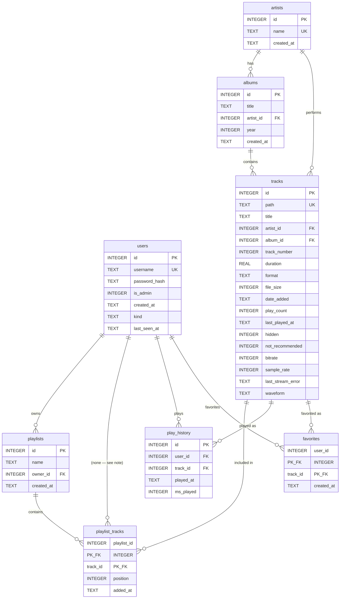

# Database Schema

SQLite (`better-sqlite3`), WAL journal mode. Confirmed live against `backend/data/brainlessmusic.db` on 2026-09-03 — every table/column/FK/index below was read via `PRAGMA table_info` / `PRAGMA foreign_key_list` / `PRAGMA index_list`, not just re-read from migration files, so this reflects what's actually applied, not just what the SQL says should be.

**Keep this file in sync with reality.** Whenever a migration is added (`backend/src/db/migrations/NNNN_*.sql`), update the affected table section(s) below and add a row to the [Change log](#change-log) in the same change — don't batch it up for later, per `.docs/CLAUDE.md`'s change-tracking convention. If you're not sure a change landed correctly, re-run the introspection snippet in [How this file was generated](#how-this-file-was-generated) against the live DB rather than trusting the migration SQL alone — see the Discrepancies section for why that distinction matters here.

## At a glance

| Property | Value |
|---|---|
| Engine | SQLite via `better-sqlite3` v12.11.1 |
| Journal mode | `wal` (confirmed live) |
| `PRAGMA foreign_keys` | **`ON`** (confirmed live) — `better-sqlite3`'s per-connection default, not set explicitly anywhere in `backend/src/`. See [Discrepancy 1](#1-foreign-keys-are-enforced-not-off) |
| `PRAGMA integrity_check` | `ok` (2026-09-03) |
| `PRAGMA foreign_key_check` | no violations (2026-09-03) |
| Domain tables | `users`, `artists`, `albums`, `tracks`, `playlists`, `playlist_tracks`, `play_history`, `favorites` |
| Infrastructure tables | `schema_migrations` (migration bookkeeping only, not domain data) |

## Entity relationships



*Note on the `users ||--o{ playlist_tracks` line above: there's no direct FK from `playlist_tracks` to `users` — it's reachable only via `playlist_tracks.playlist_id → playlists.owner_id → users.id`. Shown for readability; not a real edge.*

## Tables

### `users`

| Column | Type | Null? | Default | Notes |
|---|---|---|---|---|
| `id` | INTEGER | — | — | **PK**, autoincrement |
| `username` | TEXT | NOT NULL | — | **UNIQUE** (case-sensitive — see [Discrepancy 3](#3-case-sensitive-uniqueness-vs-case-insensitive-display-sort)) |
| `password_hash` | TEXT | NOT NULL | — | bcrypt, 12 rounds |
| `is_admin` | INTEGER | NOT NULL | `0` | boolean-as-int (see [Discrepancy 5](#5-booleans-are-stored-as-integer)). Set from the admin Users page, or `npm run set-admin -- <username>` for recovery |
| `created_at` | TEXT | NOT NULL | `datetime('now')` | |
| `kind` | TEXT | NOT NULL | `'account'` | `'account'` (has a password, can log in) or `'guest'` (minted by the title screen's enter button, `password_hash` is `''` and `/auth/login` refuses it before reaching bcrypt). Added `0012` |
| `last_seen_at` | TEXT | — | — | Last `GET /auth/me` by this row; NULL until the first one. Only read by `pruneIdleGuests`, which falls back to `created_at`. Added `0012` |

**FKs:** none (root entity).
**Indexes:** unique index on `username` (auto, from the `UNIQUE` constraint); `idx_users_kind_last_seen` on `(kind, last_seen_at)` — both guest queries filter on kind and order by staleness.
**Referenced by:** `playlists.owner_id`, `play_history.user_id`, `favorites.user_id`, `playback_state.user_id`.

**Guests are deletable and accounts are not.** `pruneIdleGuests` removes
`kind = 'guest'` rows idle past `GUEST_IDLE_DAYS` along with their `favorites`,
`playlists`/`playlist_tracks`, `play_history` and `playback_state` rows — nothing
can ever authenticate as a guest row again once its token is lost, so those rows
have no other way to be reclaimed. It runs only when `POST /auth/guest` hits
`MAX_GUESTS`, never on a timer, and cannot match an account at any age.

### `artists`

| Column | Type | Null? | Default | Notes |
|---|---|---|---|---|
| `id` | INTEGER | — | — | **PK**, autoincrement |
| `name` | TEXT | NOT NULL | — | **UNIQUE**, case-sensitive |
| `created_at` | TEXT | NOT NULL | `datetime('now')` | |

**FKs:** none (root entity).
**Indexes:** unique index on `name` (auto).
**Referenced by:** `albums.artist_id`, `tracks.artist_id`.
**Row count (2026-09-03):** 4 — checked for case-variant duplicates (e.g. "Sting" vs "STING"), none currently exist.

### `albums`

| Column | Type | Null? | Default | Notes |
|---|---|---|---|---|
| `id` | INTEGER | — | — | **PK**, autoincrement |
| `title` | TEXT | NOT NULL | — | part of composite unique constraint below |
| `artist_id` | INTEGER | nullable | — | **FK → `artists.id`**, `ON DELETE NO ACTION` |
| `year` | INTEGER | nullable | — | |
| `created_at` | TEXT | NOT NULL | `datetime('now')` | |
| `artwork_id` | TEXT | nullable | — | filename of the cached cover: `<sha256>.<jpg\|png\|webp\|gif>` under `ARTWORK_PATH`. First cover found among the album's tracks wins; never overwritten once set, so a re-scan can't make it flip |

**FKs:** `artist_id → artists.id` (`NO ACTION` / `NO ACTION`).
**Indexes:** `idx_albums_artist_id` on `artist_id`; unique composite index on `(title, artist_id)` (auto, from the `UNIQUE(title, artist_id)` constraint) — same title under different artists (or `NULL` artist) is allowed, exact duplicate not.
**Referenced by:** `tracks.album_id`.

### `tracks`

| Column | Type | Null? | Default | Notes |
|---|---|---|---|---|
| `id` | INTEGER | — | — | **PK**, autoincrement |
| `path` | TEXT | NOT NULL | — | **UNIQUE**, case-sensitive (see [Discrepancy 3](#3-case-sensitive-uniqueness-vs-case-insensitive-display-sort)) — absolute filesystem path, upsert key for scan/upload |
| `title` | TEXT | NOT NULL | — | |
| `artist_id` | INTEGER | nullable | — | **FK → `artists.id`**, `ON DELETE NO ACTION` |
| `album_id` | INTEGER | nullable | — | **FK → `albums.id`**, `ON DELETE NO ACTION` |
| `track_number` | INTEGER | nullable | — | |
| `duration` | REAL | nullable | — | seconds |
| `format` | TEXT | nullable | — | codec/container, e.g. `"Opus"` |
| `file_size` | INTEGER | NOT NULL | — | bytes |
| `date_added` | TEXT | NOT NULL | `datetime('now')` | |
| `play_count` | INTEGER | NOT NULL | `0` | denormalized, kept in sync with `play_history` by `recordScrobble()` in one transaction |
| `last_played_at` | TEXT | nullable | — | denormalized, same as above |
| `hidden` | INTEGER | NOT NULL | `0` | boolean-as-int — added in `0006`, admin-only write via `PATCH /tracks/:id` |
| `not_recommended` | INTEGER | NOT NULL | `0` | boolean-as-int — added in `0006`, admin-only write |
| `bitrate` | INTEGER | nullable | — | added in `0006`. **Only populated for tracks scanned/uploaded since `0006` landed** — existing rows stay `NULL` until re-scanned or re-uploaded, not backfilled |
| `sample_rate` | INTEGER | nullable | — | added in `0006`, same backfill caveat as `bitrate` |
| `last_stream_error` | TEXT | nullable | — | added in `0006`, written by the stream route on failure (missing file, transcode error) |
| `waveform` | TEXT | nullable | — | added in `0009`. Base64 of one unsigned byte per bucket (128 buckets), each the peak amplitude of that slice of the track. Computed from the file on the first `GET /tracks/:id/waveform` and cached here. `NULL` means "not yet asked for", never "cannot be drawn" — failures are deliberately not recorded, because the usual cause is a file mid-copy or moved and both fix themselves. Base64 rather than a JSON array: ~9MB across 50k tracks against ~35MB |
| `missing_since` | TEXT | nullable | — | added in `0010`. ISO timestamp of when the file at `path` was first observed absent by the reconciliation sweep; `NULL` means present. Set once and not re-stamped on later sweeps — it answers "since when", so re-stamping would make a months-old absence look like this morning's. Cleared (along with `last_stream_error`) the moment the file comes back, so a library on a mount that comes and goes heals itself. **A flag, never a deletion** — removing the row would take `favorites` and `playlist_tracks` entries with it, for a file that may still exist elsewhere |
| `artwork_id` | TEXT | nullable | — | added in `0007`. Filename of the cached cover embedded in *this* file: `<sha256>.<jpg\|png\|webp\|gif>` under `ARTWORK_PATH`. Same backfill caveat as `bitrate` — existing rows stay `NULL` until re-scanned. `GET /tracks/:id/cover` falls back to `albums.artwork_id` when this is `NULL` |

**FKs:** `artist_id → artists.id`, `album_id → albums.id` (both `NO ACTION` / `NO ACTION`).
**Indexes:** `idx_tracks_artist_id`, `idx_tracks_album_id`, `idx_tracks_title`, `idx_tracks_hidden`, `idx_tracks_not_recommended`, `idx_tracks_missing_since`; unique index on `path` (auto).
**Referenced by:** `playlist_tracks.track_id`, `play_history.track_id`, `favorites.track_id`.
**No `updated_at`** — see [Discrepancy 6](#6-no-updated_at-anywhere).

### `playlists`

| Column | Type | Null? | Default | Notes |
|---|---|---|---|---|
| `id` | INTEGER | — | — | **PK**, autoincrement |
| `name` | TEXT | NOT NULL | — | |
| `owner_id` | INTEGER | NOT NULL | — | **FK → `users.id`**, `ON DELETE NO ACTION` |
| `created_at` | TEXT | NOT NULL | `datetime('now')` | |

**FKs:** `owner_id → users.id` (`NO ACTION` / `NO ACTION`).
**Indexes:** `idx_playlists_owner_id`.
**Referenced by:** `playlist_tracks.playlist_id`.
**Ownership enforcement is app-layer, not DB-layer** — every route touching a playlist by id goes through `loadOwnedPlaylist()` (`routes/playlists.ts`), returning `403` for a non-owner. The schema itself doesn't prevent a different user's request from being routed here; that's entirely `loadOwnedPlaylist`'s job.

### `playlist_tracks`

| Column | Type | Null? | Default | Notes |
|---|---|---|---|---|
| `playlist_id` | INTEGER | NOT NULL | — | **PK (composite, 1 of 2)**, **FK → `playlists.id`**, `ON DELETE NO ACTION` |
| `track_id` | INTEGER | NOT NULL | — | **PK (composite, 2 of 2)**, **FK → `tracks.id`**, `ON DELETE NO ACTION` |
| `position` | INTEGER | NOT NULL | — | ordering within the playlist |
| `added_at` | TEXT | NOT NULL | `datetime('now')` | |

**FKs:** `playlist_id → playlists.id`, `track_id → tracks.id` (both `NO ACTION` / `NO ACTION`).
**PK:** composite `(playlist_id, track_id)` — a track can only appear once per playlist (no duplicate entries; reordering rewrites `position`, doesn't insert a second row).
**Indexes:** `idx_playlist_tracks_playlist_id`, `idx_playlist_tracks_track_id`, plus the composite PK's own auto index.
**Deletion order matters:** `deletePlaylist()` (`db/playlists.ts`) deletes from here before deleting the `playlists` row — required because FKs are enforced and don't cascade (see [Discrepancy 1](#1-foreign-keys-are-enforced-not-off)/[2](#2-no-cascade-anywhere--every-delete-path-must-clean-up-dependents-manually-in-order)). Same pattern in `deleteTrackRow()` (`db/library.ts`) for the `track_id` side.

### `play_history`

| Column | Type | Null? | Default | Notes |
|---|---|---|---|---|
| `id` | INTEGER | — | — | **PK**, autoincrement |
| `user_id` | INTEGER | NOT NULL | — | **FK → `users.id`**, `ON DELETE NO ACTION` |
| `track_id` | INTEGER | NOT NULL | — | **FK → `tracks.id`**, `ON DELETE NO ACTION` |
| `played_at` | TEXT | NOT NULL | `datetime('now')` | |
| `ms_played` | INTEGER | nullable | — | optional, client-reported |

**FKs:** `user_id → users.id`, `track_id → tracks.id` (both `NO ACTION` / `NO ACTION`).
**Indexes:** `idx_play_history_user_played_at` (composite, `user_id, played_at` — backs `GET /me/history`), `idx_play_history_track_id` (backs `GET /tracks/:id/history`).
**Append-only in practice** — no update/delete path exists for individual history rows; `deleteTrackRow()` bulk-deletes by `track_id` when a track is hard-deleted, and that's the only delete path today.

### `favorites`

| Column | Type | Null? | Default | Notes |
|---|---|---|---|---|
| `user_id` | INTEGER | NOT NULL | — | **PK (composite, 1 of 2)**, **FK → `users.id`**, `ON DELETE NO ACTION` |
| `track_id` | INTEGER | NOT NULL | — | **PK (composite, 2 of 2)**, **FK → `tracks.id`**, `ON DELETE NO ACTION` |
| `created_at` | TEXT | NOT NULL | `datetime('now')` | |

**FKs:** `user_id → users.id`, `track_id → tracks.id` (both `NO ACTION` / `NO ACTION`).
**PK:** composite `(user_id, track_id)` — a track can only be favorited once per user; `starTrack()`/`unstarTrack()` are both idempotent (`INSERT OR IGNORE` / plain `DELETE`), a deliberate toggle-style choice.
**Indexes:** `idx_favorites_user_id`, plus the composite PK's own auto index.

### `schema_migrations` (infrastructure, not domain data)

| Column | Type | Null? | Default | Notes |
|---|---|---|---|---|
| `id` | TEXT | — | — | **PK** — the migration filename, e.g. `"0006_add_admin_and_track_management_fields.sql"` |
| `applied_at` | TEXT | NOT NULL | `datetime('now')` | |

Written by `backend/src/db/migrate.ts` on every `npm run migrate` — not something app code reads or writes directly.

## Relationship summary

| Child table | FK column(s) | → Parent table | `ON DELETE` | Cascade handled by |
|---|---|---|---|---|
| `albums` | `artist_id` | `artists` | `NO ACTION` | nothing deletes artists today — no landmine yet, see [Discrepancy 2](#2-no-cascade-anywhere--every-delete-path-must-clean-up-dependents-manually-in-order) |
| `tracks` | `artist_id`, `album_id` | `artists`, `albums` | `NO ACTION` | same as above |
| `playlists` | `owner_id` | `users` | `NO ACTION` | nothing deletes users today — no landmine yet, but see the same discrepancy for what a future user-delete feature would need |
| `playlist_tracks` | `playlist_id` | `playlists` | `NO ACTION` | `deletePlaylist()` (`db/playlists.ts`) — deletes `playlist_tracks` rows first |
| `playlist_tracks` | `track_id` | `tracks` | `NO ACTION` | `deleteTrackRow()` (`db/library.ts`) — deletes `playlist_tracks` rows first |
| `play_history` | `user_id` | `users` | `NO ACTION` | nothing deletes users today |
| `play_history` | `track_id` | `tracks` | `NO ACTION` | `deleteTrackRow()` — deletes `play_history` rows first |
| `favorites` | `user_id` | `users` | `NO ACTION` | nothing deletes users today |
| `favorites` | `track_id` | `tracks` | `NO ACTION` | `deleteTrackRow()` — deletes `favorites` rows first |

## Discrepancies / things worth knowing

### 1. Foreign keys ARE enforced (not off)

Every `.docs` file that mentioned FK enforcement before this pass (`STATUS.md`, `CHANGELOG.md`, `FUNCTIONLOG.md`, and a code comment in `db/library.ts`) said constraints weren't enforced — "no `PRAGMA foreign_keys`" — and treated the manual dependent-row cleanup in `deleteTrackRow()`/`deletePlaylist()` as pure hygiene against silent orphaning. **That was wrong.** Confirmed live: `db.pragma('foreign_keys', {simple:true})` returns `1` on a fresh connection, with no explicit `PRAGMA foreign_keys = ON` anywhere in `backend/src/`. `better-sqlite3` (this project's driver, v12.11.1) turns it on by default per connection — unlike the raw SQLite C library, which defaults it off.

Practical effect: the manual cleanup in `deleteTrackRow()` and `deletePlaylist()` isn't just good hygiene, it's **required** — without it, the final `DELETE` on the parent row throws `SQLITE_CONSTRAINT_FOREIGNKEY` instead of silently orphaning anything. Both functions already do this in the correct order (delete dependents, then the parent), so nothing is currently broken — the documentation was wrong about the mechanism, not about what code needed to exist. All four `.docs` locations were corrected in this pass; this file is now the source of truth going forward.

### 2. No cascade anywhere — every delete path must clean up dependents manually, in order

Every FK in this schema is `NO ACTION` / `NO ACTION`. Combined with Discrepancy 1, that means **any future code that deletes a `users`, `artists`, `albums`, or `playlists` row will throw a constraint error unless it manually deletes every dependent row first**, same pattern as `deleteTrackRow()`. Concretely, if a "delete user" admin feature ever gets built, it needs (at minimum, in order): `favorites WHERE user_id`, `play_history WHERE user_id`, `playlist_tracks WHERE playlist_id IN (SELECT id FROM playlists WHERE owner_id = ?)`, `playlists WHERE owner_id`, then `users`. Nothing today deletes a user, artist, or album row, so this isn't an active bug — it's a landmine for whoever builds that feature next, flagged here so it isn't rediscovered the hard way.

### 3. Case-sensitive uniqueness vs. case-insensitive display/sort

`artists.name UNIQUE` and `albums.UNIQUE(title, artist_id)` use SQLite's default `BINARY` collation — case-sensitive. But every browse/sort query (`db/browse.ts`) orders with `COLLATE NOCASE`. That mismatch means "Sting" and "STING" from inconsistently-tagged files would be accepted as two distinct `artists` rows (not deduplicated by `findOrCreateArtist`'s exact-match lookup), then sorted right next to each other in a case-insensitive list — reading like a UI bug when it's actually a data-dedup gap. Checked live: only 4 artists exist today, no case collisions currently. Same applies to `tracks.path UNIQUE` — case-sensitive, which matches the case-sensitive Linux/WSL2 filesystem this project runs on (per `.docs/CLAUDE.md`), but would behave differently if ever deployed to a case-insensitive filesystem.

### 4. `hidden` / `not_recommended` defaults are asymmetric by design, not oversight

`hidden` defaults to excluding a track from normal `GET /tracks` browsing; `not_recommended` defaults to **including** it (only meant to be excluded from radio/shuffle logic, which doesn't exist yet — see `.docs/features/library-management-interface/planning.md`). If you're reading the schema cold, `NOT NULL DEFAULT 0` on both columns looks symmetric; the asymmetry lives entirely in `db/browse.ts`'s `buildTrackFilter()` (`hidden` defaults to `'exclude'`, `notRecommended` defaults to `'all'`), not in the schema itself.

### 5. Booleans are stored as INTEGER

SQLite has no native boolean type. `users.is_admin`, `tracks.hidden`, `tracks.not_recommended` are all `INTEGER NOT NULL DEFAULT 0`, and the app layer casts (`Boolean(row.hidden)` in `db/browse.ts`) when shaping API responses. Standard SQLite convention, not a bug — noted here so a future raw query against these columns doesn't assume a `BOOLEAN` type exists to check against.

### 6. No `updated_at` anywhere

No table in this schema tracks a last-modified timestamp — not `tracks` (tag edits via `PATCH` leave no trace of *when* they happened beyond the edit itself), not `playlists` (renames are silent), not `users`. `tracks.date_added`, `play_history.played_at`, `tracks.last_played_at`, `favorites.created_at`, `playlist_tracks.added_at` all exist, but they're creation/event timestamps, not edit-audit ones. Not an active problem at this project's scale (a friends-and-family library), but worth knowing before building anything that wants to answer "when was this track's tags last touched."

### 7. FTS5 search — resolved 2026-09-09 (migration `0008`)

Previously flagged here as a stated-but-unbuilt plan: `.docs/CLAUDE.md` and `.docs/reference/tech-stack.md` both described FTS5 virtual tables kept in sync via triggers, while the live schema had none and `searchLibrary()` did `LIKE '%...%'` scans. Migration `0008_create_search_index.sql` closes the gap. See [Search index](#search-index) below.

## Search index

Added by `0008_create_search_index.sql` (roadmap step 9). Three FTS5 virtual tables, each with `rowid` equal to the source table's `id`, so a `MATCH` result joins straight back with no extra column:

| Table | Columns | Indexes text from |
|---|---|---|
| `tracks_fts` | `title`, `artist`, `album` | `tracks.title`, plus the **denormalised** `artists.name` and `albums.title` for that track |
| `artists_fts` | `name` | `artists.name` |
| `albums_fts` | `title` | `albums.title` |

**Tokenizer: `trigram remove_diacritics 1`, not the default `unicode61`.** This is the load-bearing choice. `unicode61` splits on whitespace and can only match from the start of a token, which breaks this library twice over: `eatles` would not find *The Beatles*, and Japanese text has no spaces, so an entire title becomes one token and only its prefix is ever findable. `trigram` indexes every 3-character run, giving true substring matching in any script — what `LIKE '%x%'` did, without the full scan.

**The cost, and where it is handled:** trigram cannot answer a query shorter than 3 characters. `buildMatchQuery()` (`backend/src/utils/ftsQuery.ts`) returns `null` for those, and `searchLibrary()` falls back to the old LIKE path. That fallback is not vestigial — a 2-character CJK query is an ordinary thing to type.

**Nine triggers** keep the index in sync (`tracks`/`artists`/`albums` × insert/update/delete). Two details matter when reading them:

- The update triggers are scoped with `AFTER UPDATE OF <columns>`, so a scrobble bumping `play_count` or an admin toggling `hidden` does not touch the index.
- `artists_fts_after_update` and `albums_fts_after_update` also rewrite the denormalised copy inside `tracks_fts`. Nothing in the app renames an artist today — tag edits find-or-create and repoint `tracks.artist_id` — but the trigger means a rename arriving by any other route can't leave stale text behind.

Both virtual tables and triggers are visible in `sqlite_master`; the FTS5 shadow tables (`*_data`, `*_idx`, `*_docsize`, `*_config`) are SQLite's own and should not be written directly.

## How this file was generated

Live introspection, not a re-read of the migration SQL (the two can drift — see Discrepancy 1 for why that distinction mattered here):

```js
const Database = require('better-sqlite3');
const db = new Database('backend/data/brainlessmusic.db');

const tables = db.prepare(
  "SELECT name FROM sqlite_master WHERE type='table' AND name NOT LIKE 'sqlite_%' ORDER BY name"
).all().map(r => r.name);

for (const t of tables) {
  console.log(t);
  console.log('columns:', db.prepare(`PRAGMA table_info(${t})`).all());
  console.log('foreign_keys:', db.prepare(`PRAGMA foreign_key_list(${t})`).all());
  console.log('indexes:', db.prepare(`PRAGMA index_list(${t})`).all());
}

console.log('foreign_keys pragma:', db.pragma('foreign_keys', { simple: true }));
console.log('journal_mode:', db.pragma('journal_mode', { simple: true }));
console.log('foreign_key_check:', db.pragma('foreign_key_check'));
console.log('integrity_check:', db.pragma('integrity_check', { simple: true }));
```

## Migration history

| Migration | Adds |
|---|---|
| `0001_create_users.sql` | `users` (id, username unique, password_hash, created_at) |
| `0002_create_library.sql` | `artists`, `albums`, `tracks` + FK indexes + `tracks.title` index |
| `0003_create_playlists.sql` | `playlists`, `playlist_tracks` (composite PK) + indexes |
| `0004_create_play_history.sql` | `play_history` + indexes; `ALTER TABLE tracks ADD play_count, last_played_at` |
| `0005_create_favorites.sql` | `favorites` (composite PK) + index |
| `0006_add_admin_and_track_management_fields.sql` | `users.is_admin`; `tracks.hidden`, `not_recommended` (+ indexes), `bitrate`, `sample_rate`, `last_stream_error` |
| `0007_add_artwork.sql` | `tracks.artwork_id`, `albums.artwork_id` — content-addressed cover art filenames |
| `0008_create_search_index.sql` | `tracks_fts`, `artists_fts`, `albums_fts` + nine sync triggers — see [Search index](#search-index) |
| `0009_add_waveform.sql` | `tracks.waveform` — cached scrubber peaks |
| `0010_add_track_missing_tracking.sql` | `tracks.missing_since` + index — when a track's file was first seen absent from disk |
| `0011_create_playback_state.sql` | `playback_state` (one row per user — `user_id` is the PK) — resume position, queue and index |
| `0012_add_user_kind.sql` | `users.kind`, `users.last_seen_at` + `idx_users_kind_last_seen` — passwordless guest rows |

## Change log

| Date | Change | Why |
|---|---|---|
| 2026-09-11 | Migration `0012_add_user_kind.sql` — `users.kind`, `users.last_seen_at`, `idx_users_kind_last_seen`; `users` section, ERD and relationship notes updated. Also **backfilled `0011` into the migration list**, which had been missing since it landed on 2026-09-10 | Passwordless guest entry. A `kind` column rather than a sentinel `password_hash`: `''` is a value `bcrypt.compare` will happily be asked about, so "this row cannot log in" would have lived in whoever remembered to check it — a column lets `/auth/login` refuse before it reaches a hash at all. Applied to the live database against `data/brainlessmusic.pre-0012-backup-2026-09-11T00-42-55.db`; `imran` (id 13) came through as `kind = 'account'` and `integrity_check` returned ok |
| 2026-09-10 | Migration `0010_add_track_missing_tracking.sql` — `tracks.missing_since` + `idx_tracks_missing_since`; `tracks` column table and index list updated | Scheduled reconciliation between the database and the disk. Applied to the live database against a `pre-0010` backup, which also picked up `0009`, still unapplied there. The first sweep flagged 11 of 30 rows, all pointing at `/mnt/wsl/music` — the tmpfs library root that was lost — and it flags rather than deletes precisely because those rows carry favorites and playlist entries for files that may still exist in a backup |
| 2026-09-03 | File created — full live-introspected schema map, ERD, per-table breakdown, relationship summary, 7 flagged discrepancies | Requested: a maintained database structure reference, checked against the real DB rather than just migration files |
| 2026-09-09 | Migration `0009_add_waveform.sql` — `tracks.waveform`; `tracks` entity and column table updated. Also backfilled `0008` into the migration list above, which it had been missing | Real waveforms in the player's scrubber. Cached on the row rather than recomputed, and computed lazily rather than during a scan: decoding a whole library to draw pictures would turn a minute-long scan into an hour, and most tracks are never played |
| 2026-09-09 | Migration `0008_create_search_index.sql` — `tracks_fts`, `artists_fts`, `albums_fts` plus nine sync triggers; new [Search index](#search-index) section, Discrepancy 7 resolved | Full-text search (roadmap step 9). Trigram tokenizer rather than the default, so mid-word and CJK substring queries keep working — `unicode61` would have been a regression from the `LIKE` scan it replaces |
| 2026-09-08 | Migration `0007_add_artwork.sql` — `artwork_id` on `tracks` and `albums`; both table sections updated | Cover art (roadmap step 4). Images are content-addressed on disk, so the column stores a filename rather than a blob: the same cover across an album's tracks is stored once, and re-scanning is a no-op instead of a rewrite |
| 2026-09-03 | Corrected `STATUS.md`, `CHANGELOG.md`, `FUNCTIONLOG.md`, and a code comment in `backend/src/db/library.ts` — all previously claimed FK enforcement was off | Found while building this file: `better-sqlite3` enforces FKs by default; live `PRAGMA foreign_keys` check confirmed `1` |
